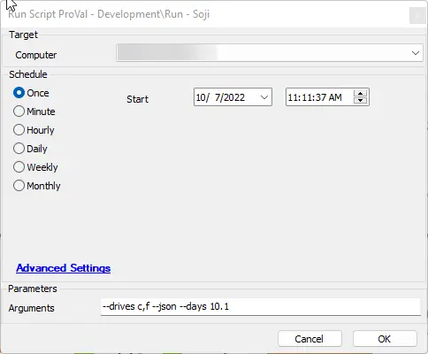

## Summary

This is an Automate script intended to execute the Soji application found in the GitHub repository.

## Sample Run

Please refer to the Soji documentation for argument options.

## Dependencies

- [Soji](https://github.com/ProVal-Tech/Soji)

### User Parameters

| Name      | Example                | Required | Description                                                                 |
|-----------|------------------------|----------|-----------------------------------------------------------------------------|
| Arguments | --drives c,f --json    | False    | Please refer to [Soji](https://github.com/ProVal-Tech/Soji) for argument usage. |

## Process

1. Install .NET 6 (if not installed)
2. Set up the environment and download Soji
3. Run Soji with the passed-in arguments
4. Compress the log files as `SojiLogs.zip` and upload them to the Automate server.

## Output

- Script log
- Desired file output to the Soji directory, e.g., JSON, etc.
- On LabTech server: `%LTShare%/Uploads/%ClientName%/%ComputerName% - %ComputerId%/SojiLogs.zip`
