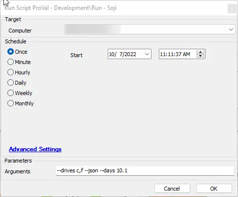

## Summary

This is an Automate script intended to execute the Soji application found in the GitHub repository.

**Note:** Soji is a destructive application by nature in that it deletes files and folders. **Take great care when using the `--days`, `--systempaths`, and `--userpaths` arguments.**

## Sample Run

Please refer to the Soji documentation for argument options.

## Dependencies

- [Soji](/docs/c762e174-5262-44b9-a3e9-97ca9ff94afc)

## Variables

| Name | Description |
| ---- | ----------- |
| ProjectName | Soji |
| WorkingDirectory | C:\ProgramData\_automation\app\Soji |
| EXEPath | C:\ProgramData\_automation\app\Soji\Soji.exe |
| LogPath | C:\ProgramData\_automation\app\Soji\SojiLogs\SojiLogs.Zip |

## User Parameters

| Name      | Example                | Required | Description                                                                 |
|-----------|------------------------|----------|-----------------------------------------------------------------------------|
| Arguments | --drives c,f --json    | False    | Please refer to [Soji](/docs/c762e174-5262-44b9-a3e9-97ca9ff94afc) for argument usage. |

## Output

- Script log
- Desired file output to the Soji directory, e.g., JSON, etc.
- On LabTech server: `%LTShare%/Uploads/%ClientName%/%ComputerName% - %ComputerId%/SojiLogs.zip`

## Changelog

### 2026-03-23

- Updated .Net8 Desktop Runtime installation logic to install the latest available version.

### 2025-04-10

- Initial version of the document
