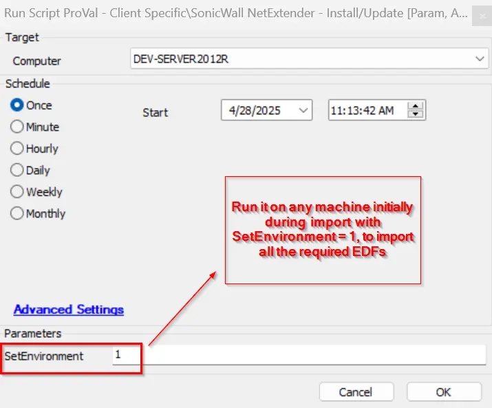
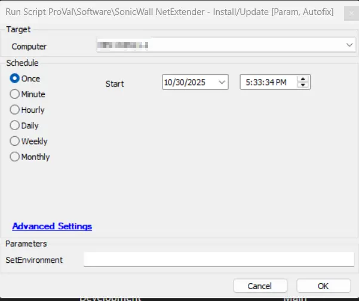

## Summary
This script installs/updates the latest version of the SonicWall NetExtender dynamically.

## Sample Run

**First Run:** Execute the script with the user parameter `SetEnvironment` as 1 to import the EDFs needed for the script.

**Regular Run:**

## Dependencies

 [Monitor - SonicWall NetExtender - Install/Update](/docs/b0ca57d2-351c-4f1d-9d98-954c1d77777e)  
 [Solution - SonicWall NetExtender - Install/Update](/docs/70d9b103-f73f-4e68-a4aa-d2651e44d09a)

## Process

- **Detects Existing Installations**: Determines whether NetExtender is already installed and identifies the suitable installer format (MSI or EXE).
- **Retrieves Latest Version Info:** This is collected by the [Script - Application - Latest Version Detection](/docs/ffb77c6c-8dd7-4ca5-82a2-327b1658cbde) and stored in the system properties `SonicWALL.NetExtender`.
- **Version Comparison:** Compares the installed version with the latest available to decide if an update is needed.
- **Architecture-Based Installer Selection:** Automatically selects the correct installer (x86, x64, or ARM64) based on the system architecture.
- **Secure Working Directory Setup:** Creates a temporary directory with appropriate permissions for safe installation.
- **Silent Installation:** Downloads and installs the software silently without user interaction.
- **Post-Installation Verification:** Confirms successful installation and reports the outcome.
- The script supports both MSI and EXE formats and includes robust error handling and validation mechanisms. If NetExtender is not already present on the system, the MSI version will be installed by default.

## Output

- Script log