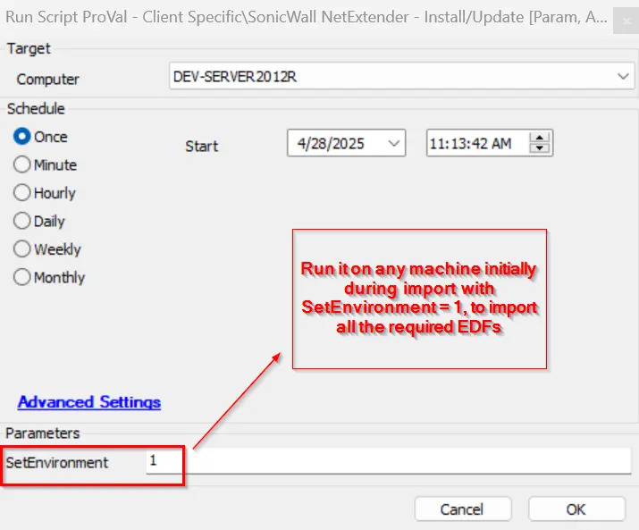
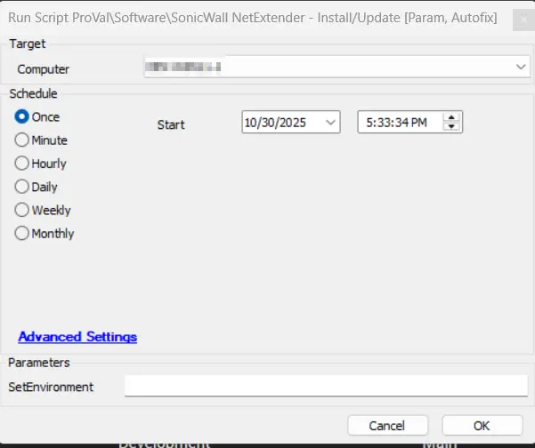

## Summary

This script installs/updates the latest version of the SonicWall NetExtender dynamically.

**Third Party Urls:**

- [https://api.github.com/repositories/197275551/contents/manifests/s/SonicWall/NetExtender](https://api.github.com/repositories/197275551/contents/manifests/s/SonicWall/NetExtender)
- [https://software.sonicwall.com/NetExtender](https://software.sonicwall.com/NetExtender)

## Sample Run

**First Run:** Execute the script with the user parameter `SetEnvironment` as 1 to import the EDFs needed for the script.  

**Regular Run:**  

## Dependencies

- [Monitor - SonicWall NetExtender - Install/Update](/docs/b0ca57d2-351c-4f1d-9d98-954c1d77777e)  
- [Solution - SonicWall NetExtender - Install/Update](/docs/70d9b103-f73f-4e68-a4aa-d2651e44d09a)

## User Parameters

| Name           | Example | Required                        | Description                                                                                                 |
|----------------|---------|----------------------------------|-------------------------------------------------------------------------------------------------------------|
| SetEnvironment| 1       | Need to set to 1 for first-time implementation | Running the script with the user parameter `SetEnvironment` as 1 will import the EDFs needed for the script. |

## Process

1. Checks for existing installations and determines the appropriate installer type (MSI or EXE)
2. Fetches the latest version information from GitHub API
3. Compares installed version with the latest available version
4. Downloads the appropriate installer based on system architecture (x86, x64, ARM64)
5. Creates a secure working directory with proper permissions
6. Downloads and installs the software silently
7. Verifies successful installation

The script supports both MSI and EXE installer formats and automatically detects the system architecture to download the correct version. It includes comprehensive error handling and installation verification. MSI version will be installed for the machines where the application is not already installed.

## Output

- Script log

## Changelog

### 2026-03-19

- Added support for ARMx64 processors
- Implemented code signing for PowerShell script

### 2025-10-30

- Fixed the script where it was not generating a ticket when Winget script was called for MSI update and failed to update SonicWall.
- The script has been updated to utilize a unified method for both installation and updates, supporting MSI and EXE formats. This enhancement eliminates the dependency on the Winget script for MSI-based installations.

### 2025-07-21

- Initial version of the document
