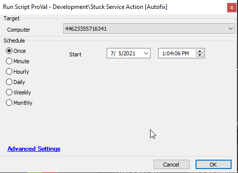

## Summary

This script detects any service that is stuck in a state other than Running or Stopped and attempts to forcefully stop that process.

**Time Saved by Automation:** 10 Minutes

## Sample Run

## Dependencies

[Stuck Service Detection](/docs/be3ca430-f53d-4198-9360-52894e5e6a6a)

## Variables

| Variable | Description                                                   |
|----------|---------------------------------------------------------------|
| Output   | Contains PowerShell output of stuck commands and their actions |

### Global Parameters

| Name    | Example | Required | Description                                           |
|---------|---------|----------|-------------------------------------------------------|
| Action  | 0       | True     | 0 - No start of service; 1 - Attempt to start the stuck service |

### Script States

| Name            | Example   | Description          |
|----------------|-----------|----------------------|
| StoppingService | Ticket_ID | Contains ticket record |

## Process

- This script checks for services in a status other than Running or Stopped.
- If a stuck service is found, the script will attempt to stop it forcefully.
- The script depends on the global parameter "Action." If set to 0, the stuck service will only be stopped. If set to 1, it will attempt to start the stuck service.
- If the action fails to stop or start the service, depending on the option selected, a ticket will be created.

## Output

- Script log
- Script state
- Ticket

