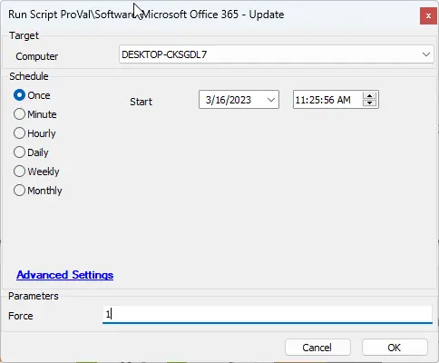
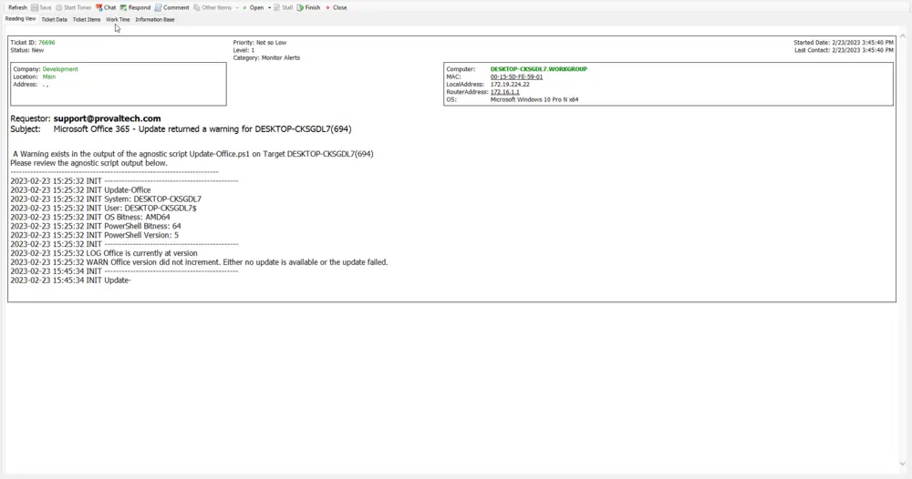

## Summary

This script is an Automate Wrapper to run the Agnostic Update-Office script.

## Sample Run

  
Set force to 1 to force Microsoft Office applications to close during the update process.

## Dependencies

- [SWM - Software Configuration - Agnostic - Update-Office](/docs/498075f7-623c-4b92-9fbc-fe0f5e7113a4  )

## Variables

Document the various variables in the script. Delete any section that is not relevant to your script.

| Name              | Description                                                                                      |
|-------------------|--------------------------------------------------------------------------------------------------|
| WorkingDirectory   | Standard Template Variable.                                                                      |
| PS1Log            | Standard Template Variable.                                                                      |
| PS1DataLog        | Standard Template Variable.                                                                      |
| PS1ErrorLog       | Standard Template Variable.                                                                      |
| LogContent        | Standard Template Variable.                                                                      |
| QueriedLog        | Necessary to determine if a warning is present in the log, since the agnostic script sets a warning. Selects the last two lines of the log file. |
| AlertType         | This sets the alert type, which can be a warning or error.                                       |
| ErrorMsg          | The associated error message for the specific script section.                                   |
| DataLogContent    | Standard Template Variable.                                                                       |
| TicketSubject     | The subject of the ticket.                                                                        |
| TicketBody        | The body of the ticket.                                                                           |

## User Parameters

| Name   | Example | Description                                                                                   |
|--------|---------|-----------------------------------------------------------------------------------------------|
| Force  | 1 or 0  | 1 will force the shutdown of Office applications during the update process. 0 does not force the shutdown of Office applications during the process. |

### Global Parameters

| Name                | Example         | Required | Description                                                  |
|---------------------|-----------------|----------|--------------------------------------------------------------|
| ProjectName         | Update-Office   | True     | The name of the agnostic script minus the .ps1              |
| TicketOnError       | 0 or 1          | True     | Toggles on/off ticketing on error.                          |
| TicketOnWarning     | 0 or 1          | True     | Toggles on/off ticketing on warning.                        |

## Output

- Script log

## Ticketing

