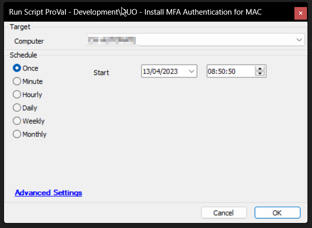
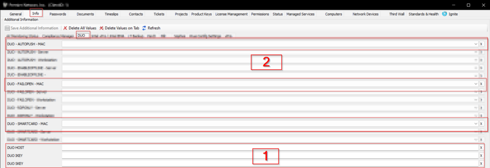
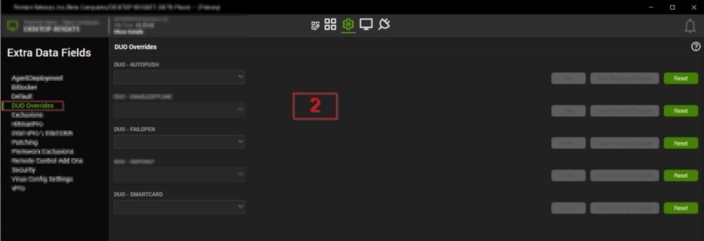

## Summary

The script attempts to install the [latest version](https://dl.duosecurity.com/MacLogon-latest.zip) of the [DUO 2FA Authentication for MAC](https://duo.com/docs/macos) Operating System.

## Sample Run



## Requirements

1. There are several EDFs involved in the process, and EDFs must be configured to make the script function properly.  
   EDFs used are:  

   Client-Level:  
     
   1. EDFs in section 1 are text boxes and must be filled in order to execute the script.
   2. EDFs in section 2 are drop-downs with "False/True" as the options. These EDFs can be used to configure the application. The default value for these EDFs is False.

2. Overrides should be set at the computer level, as shown below:  
     
   Values set at the computer level will override the values set at the client level.

**Note**: The EDFs mentioned in section 1 will be imported along with the script, but EDFs in section 2 must be created manually. The following SQL queries can be executed from a RAWSQL monitor to create these EDFs:

```
INSERT IGNORE INTO `extrafield` VALUES
('',1,'DUO - SMARTCARD',0,0,2,'DUO Overrides',0,0,'Yes~No','97dbf325-425e-4f6e-97c6-793462a1cdcf',0,0,0,0,'',''),
('',1,'DUO - AUTOPUSH',0,0,2,'DUO Overrides',0,0,'Yes~No','97dba59c-2dcb-46a6-9d2f-1af4951d653e',0,0,0,0,'',''),
('',1,'DUO - FAILOPEN',0,0,2,'DUO Overrides',0,0,'Yes~No','5d34c156-ea24-4bea-b95c-4e374b7f3de5',0,0,0,0,'',''),
('', 3, 'DUO - FAILOPEN - MAC', 0, 0, 2, 'DUO', 0, 0, 'False~True', '124a5519-a440-4256-8dd2-81ee633f1027', 0, 0, 0, 0, '', ''),
('', 3, 'DUO - SMARTCARD - MAC', 0, 0, 2, 'DUO', 0, 0, 'False~True', '0a6ec75a-db4f-4acf-9269-94da9e1faad7', 0, 0, 0, 0, '', ''),
('', 3, 'DUO - AUTOPUSH - MAC', 0, 0, 2, 'DUO', 0, 0, 'False~True', 'b461afaa-9c1a-4491-9228-3c276ad90103', 0, 0, 0, 0, '', '');
Call v_Extradata(1,'Computers');
Call v_Extradata(3,'Clients');
Call v_Extradatarefresh(1,'Computers');
Call v_Extradatarefresh(3,'Clients');
```

## Variables

| Name            | Description                                                                                                                                         |
|-----------------|-----------------------------------------------------------------------------------------------------------------------------------------------------|
| STATUS          | STATUS returned by the monitor set (FAILED/SUCCESS/WARNING). The script can be used as an autofix with an alert template as well.                 |
| Host            | To store the value of the Client level EDF, DUO HOST                                                                                             |
| SKEY            | To store the value of the Client level EDF, DUO SKEY                                                                                             |
| IKEY            | To store the value of the Client level EDF, DUO IKEY                                                                                             |
| Arguments       | Arguments to be passed to the command, calculated by a SQL query based on the client and computer level "DUO - *" EDFs.                          |
| Autopush        | True/False; From Client Level EDF 'DUO - AUTOPUSH - MAC' or from Computer Level EDF 'DUO - AUTOPUSH' if overridden. Default value is FALSE, in case both client and computer level EDFs are blank. |
| SmartCard       | True/False; From Client Level EDF 'DUO - SMARTCARD - MAC' or from Computer Level EDF 'DUO - SMARTCARD' if overridden. Default value is FALSE, in case both client and computer level EDFs are blank. |
| FailOpen        | True/False; From Client Level EDF 'DUO - FAILOPEN - MAC' or from Computer Level EDF 'DUO - FAILOPEN' if overridden. Default value is FALSE, in case both client and computer level EDFs are blank. |
| FilesInfo       | Parsed output of the command to extract the downloaded archived file.                                                                             |
| FolderName      | Path to the extracted contents from the archived (.zip) file.                                                                                     |
| ConfigureFile   | Path to the extracted configuration file.                                                                                                         |
| NotConfiguredFile| Path to the extracted unconfigured file.                                                                                                         |
| FileVersion     | Version of the extracted files.                                                                                                                    |
| FinalPackage    | Path to the installer.                                                                                                                              |

## Output

- Script Logs

