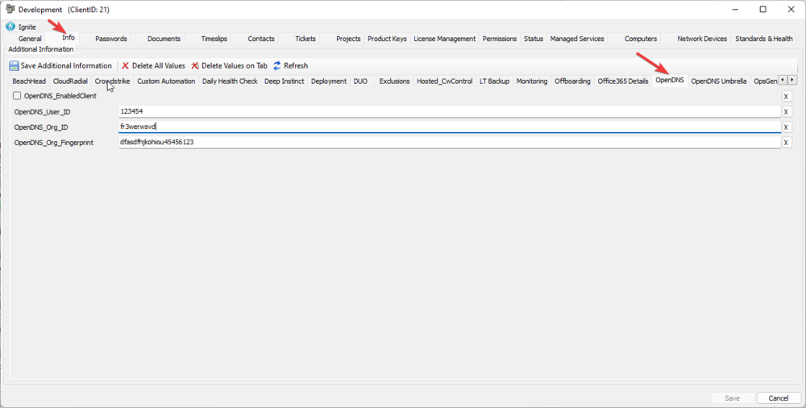
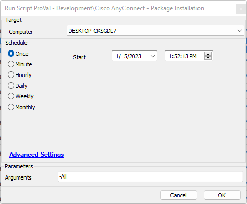
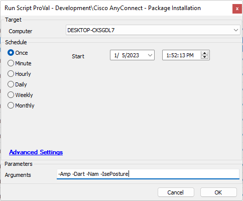

## Summary

This script will install Cisco AnyConnect and any of its desired components.

This utilizes the related Install-AnyConnect agnostic script.

Ignore parameters:
- ClientID (Gathered from EDF)
- Fingerprint (Gathered from EDF)
- OrgId (Gathered from EDF)

### Argument Options
- -Amp
- -Dart
- -Gina
- -Nam
- -Nvm
- -IsePosture
- -Posture
- -Umbrella (Requires Client ID, Org ID, and Fingerprint in the agnostic script; however, this will be set to the client's EDF)
- -ALL (Requires Client ID, Org ID, and Fingerprint in the agnostic script; however, this will be set to the client's EDF)

---

## Implementation

- Set up the Client Level EDF

- The OpenDNS_EnabledClient checkbox can be utilized to automatically execute this script if desired.

---

## Sample Run

Install all Cisco AnyConnect packages.

Install specific AnyConnect packages.

---

## Dependencies

- Please reference the Agnostic content document for more information.

---

## Variables

| Name        | Description                                                 |
|-------------|-------------------------------------------------------------|
| OrgID       | The ID set in the client level OpenDNS EDF under OrgID    |
| Fingerprint | The fingerprint set in the client level OpenDNS EDF under Fingerprint |
| Client      | The userID set in the client level OpenDNS EDF under ClientID |

#### User Parameters

| Name      | Example                     | Required | Description                                                                                                                                                                                                                                                                                                                                                   |
|-----------|-----------------------------|----------|----------------------------------------------------------------------------------------------------------------------------------------------------------------------------------------------------------------------------------------------------------------------------------------------------------------------------------------------------------------|
| Arguments | -All -Dart -Amp -Umbrella | False    | This is the argument you would pass to the Install-AnyConnect Agnostic script. You may ignore the ClientID, OrgID, and Fingerprint parameters in all cases, as the script will add the corresponding EDF value as that parameter value during the processing of this installation. Providing a ClientID, OrgID, and Fingerprint or any combination of those in the Arguments user parameter will overwrite any EDF value set at the client level. |

---

## Process

1. Get the fingerprint, OrgID, and client from the client level EDF.
2. Check if the argument is not All or Umbrella; if it is not, use the arguments as is.
3. Check if the argument does not contain Umbrella; if it does not, use the arguments as is.
4. Check if the argument contains -ClientID; if it does not, add it using the EDF.
5. Check if the argument contains -OrgID; if it does not, add it using the EDF.
6. Check if the argument contains -Fingerprint; if it does not, add it using the EDF.
7. Run the agnostic script with the required arguments.

---

## Output

- Script log

