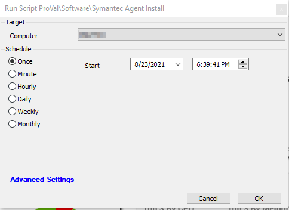

## Summary

The script installs the Symantec Agent on the Windows machine.

**Time Saved by Automation:** 10 Minutes

## Sample Run

## Dependencies

- `Symantec_Agent_setup.exe` must exist in the `LtShare/Transfer/Software/` folder on the Automate server.

## Process

- Downloads the `setup.exe` file from the Automate server.
- Installs the Symantec Agent through this `setup.exe` file silently.

## Output

- Script log

