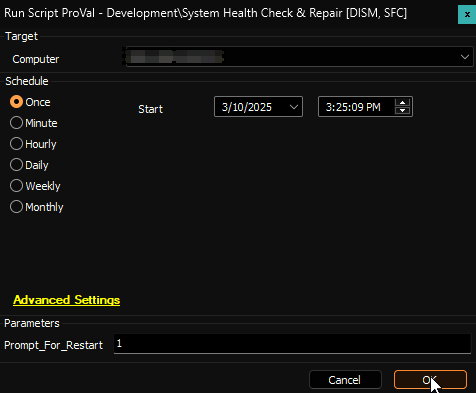
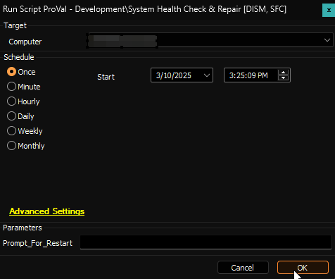
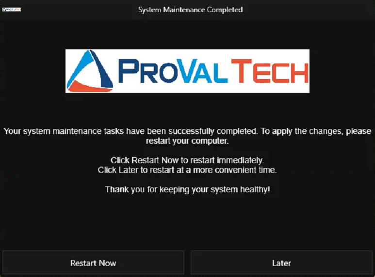

## Summary

The script performs comprehensive Windows system health checks and repairs using DISM and SFC tools. The script executes the following commands in sequence:

1. `DISM /Online /Cleanup-Image /CheckHealth` - Verifies if there are any corruption issues
2. `DISM /Online /Cleanup-Image /ScanHealth` - Performs a more advanced scan of system image
3. `DISM /Online /Cleanup-Image /RestoreHealth` - Fixes identified corruption issues
4. `sfc /scannow` - Scans and repairs protected system files

After completing all scans and repairs, the script handles system restart in one of two ways:

- Automatic restart without prompting (default behavior)
- Interactive mode where it prompts the user for restart confirmation when the parameter is set

This script is particularly useful for maintaining system integrity and resolving Windows system file corruption issues.

## Sample Run

**Example 1:** Running with interactive mode  
This example shows the script execution with the prompt parameter enabled, allowing user confirmation before restart.  


**Example 2:** Running with automatic restart  
This example demonstrates the default behavior where the script automatically restarts the system after completion.  


## User Parameters

| Name | Example | Mandatory | Description |
|------|---------|-----------|-------------|
| Prompt_For_Restart | `1` | False | Setting this parameter to 1 enables interactive reboot mode, where the script will prompt the user for restart confirmation instead of forcing an automatic system restart. |

## Sample Prompt

  
**Note:** The header image and icon displayed in the prompt will vary based on your environment.

## Output

- Script Log

### Sample Output

```Log
Command: Dism /Online /Cleanup-Image /CheckHealth

Result: 

Deployment Image Servicing and Management tool
Version: 10.0.19041.3636
Image Version: 10.0.19045.5487
No component store corruption detected.
The operation completed successfully.

Command: Dism /Online /Cleanup-Image /ScanHealth

Result: 

Deployment Image Servicing and Management tool
Version: 10.0.19041.3636
Image Version: 10.0.19045.5487
[==========================100.0%==========================] 
No component store corruption detected.
The operation completed successfully.

Command: Dism /Online /Cleanup-Image /RestoreHealth

Result: 

Deployment Image Servicing and Management tool
Version: 10.0.19041.3636
Image Version: 10.0.19045.5487
[==========================100.0%==========================] 
The restore operation completed successfully.
The operation completed successfully.

Command: sfc /scannow

Result:                                                              

Beginning system scan.  This process will take some time.

Beginning verification phase of system scan.

Verification 100% complete.

Windows Resource Protection did not find any integrity violations.
```