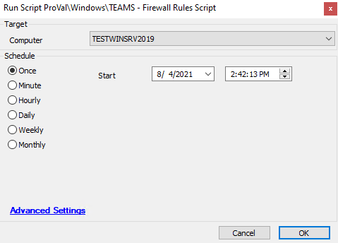

## Summary

### **This script needs revision.**

This script executes PowerShell commands that set rules for Teams for all users except public users and those with administrative accounts matching 'ADMINI~*'. The rule name is "Teams.exe for user (username)."

**Time Saved by Automation:** 5 Minutes

## Sample Run

## Dependencies

- Windows OS and PowerShell version 3.0 or greater.

## Variables

- `@Result@` -> Result of the PowerShell command to add the firewall rule.
- `@shellresult@` -> Results of checking the PowerShell version on the machine.

## Process

1. Check the PowerShell version on the machine for v3.0 or greater.
2. Run PowerShell to add the firewall rule for Teams.
3. Log the results in the script logs in Automate.

## Output

- Script log

