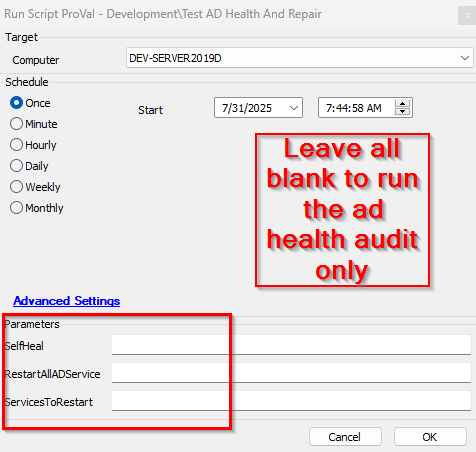
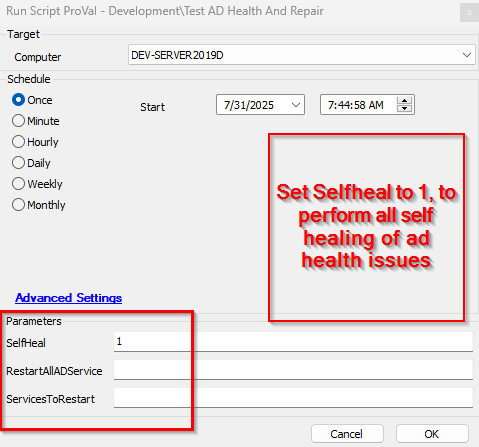
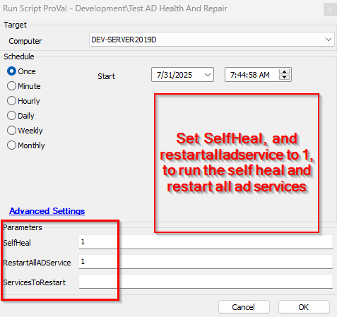
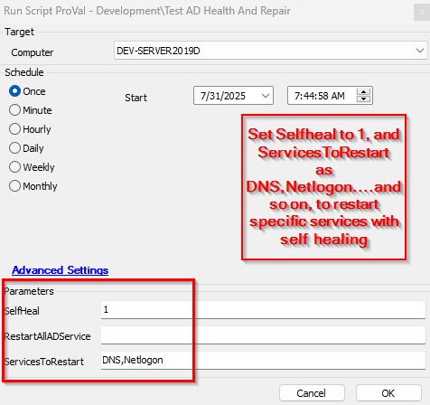

## Summary
This script automates health checks, self-healing, and conditional service restarts for Active Directory Domain Controllers. It helps administrators quickly identify and remediate AD issues, ensuring domain controller reliability and service continuity.

## Dependencies
[Test-ADHealthAndRepair](/docs/powershell/f2c09601-b391-449b-9380-c022f1829eda)

## Sample Run

### User Parameters

| **Name**              | **Example**       | **Required** | **Description**                                                                                          |
|-----------------------|-------------------|--------------|----------------------------------------------------------------------------------------------------------|
| `SelfHeal`            | `1`               | `False`      | If set to `1`, it runs a health check and initiates self-healing actions if issues are found.           |
| `RestartAllADService` | `1`               | `False`      | If set to `1`, this runs a health check, initiates self-healing actions, and restarts all core AD-related services if issues are detected. Note that `SelfHeal` must also be set to `1` for this function to operate. |
| `ServicesToRestart`   | `DNS,Netlogon`    | `False`      | If set to specific service names (comma-separated, e.g., `DNS,Netlogon`), it runs a health check, initiates self-healing actions, and restarts only the specified AD-related services if issues are found. |

## Process

This script audits Active Directory health, remediates detected issues, and restarts AD-related services as needed. It is designed to run on Domain Controllers and supports multiple operational modes via parameters. Service restart actions are only performed if issues are detected and the SelfHeal option is enabled.

.FUNCTIONALITY
- Checks if the script is running on a Domain Controller.
- Initializes required PowerShell modules and environment settings.
- Tracks and stores the last script run time for event log queries.
- Performs AD health checks using dcdiag, repadmin /replsummary, and repadmin /showrepl.
- Queries Windows event logs for recent critical or error events in DNS Server and Directory Service logs.
- Logs all findings and outcomes.
- If issues are detected and self-healing is enabled, runs remediation steps:
    - Synchronizes AD replication (repadmin /syncall /AdeP).
    - Flushes DNS resolver cache (ipconfig /flushdns).
    - Re-registers DNS records (ipconfig /registerdns).
    - Updates domain controller DNS registration (nltest /dsregdns).
- If issues are detected and SelfHeal is enabled, restarts all or selected AD-related services (NTDS, DNS, kdc, Netlogon, W32Time) as specified by parameters.
- Logs the outcome of each service restart and remediation step.
- Updates and stores the script run time for future audits.

## Payload

.EXAMPLE

- .\Test-ADHealthAndRepair.ps1

Runs a health check only. No self-healing or service restart actions will be performed.

.EXAMPLE

- .\Test-ADHealthAndRepair.ps1 -SelfHealCheck

Runs a health check and initiates self-healing actions if issues are found.

.EXAMPLE

- .\Test-ADHealthAndRepair.ps1 -SelfHealCheck -RestartAllADServiceCheck

Runs a health check, initiates self-healing actions, and restarts all core AD-related services if issues are found.

.EXAMPLE

- .\Test-ADHealthAndRepair.ps1 -SelfHealCheck -ServicesToRestartCheck 'DNS,Netlogon'
  
Runs a health check, initiates self-healing actions, and restarts only the specified AD-related services if issues are found.

## Output

- .\Test-ADHealthAndRepair-log.txt
- .\Test-ADHealthAndRepair-error.txt
