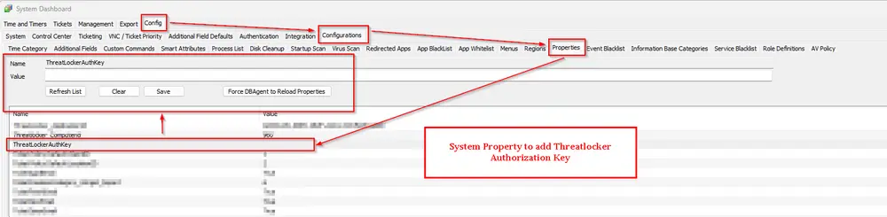

## Summary

This script installs the ThreatLocker agent on Windows and Mac operating systems.

## EDF Configuration

**For Windows Deployment:**

- Enter the Threatlocker Authorization key in System Properties under system property `ThreatLockerAuthKey`
- Enter the Organization name in Client EDF `Threatlocker_Organization_Name`
- Enter the Threatlocker Group ID in Client EDF `ThreatlockerGroupID`

  


**For MAC Deployment:**

- Enter Threatlocker Mac in Client EDF `ThreatLockerMacGroupKey`


## Sample Run

**First Run:**  
Set 'Set_Environment' to 1 to create system properties needed for the script.  


**General Execution:**  


## Dependencies

- [Internal Monitor: Deploy Threatlocker Agent](/docs/392a41e0-bbe1-4270-87a0-0a093aff3671)  
- [Solution: Threatlocker Agent Deployment](/docs/2b68cbb1-1406-4a4b-9173-e91f1b0c7f88)

## Global Parameters

| Name      | Example | Required | Description                                                                 |
|-----------|---------|----------|-----------------------------------------------------------------------------|
| Ticketing | 1       | False    | Set it to '1' to enable ticketing. Leave it blank or '0' to disable it.     |

## User Parameters

| Name           | Example | Required                        | Description                                                                                                 |
|----------------|---------|----------------------------------|-------------------------------------------------------------------------------------------------------------|
| Set_Environment| 1       | Need to set to 1 for first-time implementation | Running the script with the user parameter 'Set_Environment' as 1 will import System Properties and EDF's needed for the script. |

## System Properties

| Name                | Example                             | Required                | Description                                                                                                 |
|---------------------|-------------------------------------|-------------------------|-------------------------------------------------------------------------------------------------------------|
| ThreatLockerAuthKey | gfjhdsiopghg-nfdo;hgdf-jdskfl;      | True (For Windows Deployment) | The assigned ThreatLocker authorization key for Windows machines. Follow the instructions to get the group key for the desired machine. [Getting your Unique Identifier from ThreatLocker \| ThreatLocker Help Center](https://threatlocker.kb.help/getting-your-unique-identifier-from-threatlocker/) |

## Client-Level EDF

| Name                       | Type | Example         | Section     | Required                   | Description                                                                                                 |
|----------------------------|------|----------------|------------|----------------------------|-------------------------------------------------------------------------------------------------------------|
| Threatlocker_Organization_Name | Text | Proval         | Threatlocker| True (For Windows Deployment) | Organization Name to be used for Threatlocker deployment. If deploying to an existing organization, that name must match the organization's name in the ThreatLocker portal. |
| ThreatLockerMacGroupKey    | Text | 1SA2345AASSSS234| Threatlocker| True (For MAC Deployment)  | Stores the Threatlocker Group key for Macintosh Machines. Follow the instructions to get the group key for the desired machine. [MAC Agent Group Key Location \| ThreatLocker Help Center (kb.help)](https://threatlocker.kb.help/mac-agent-group-key-location/) |
ThreatlockerGroupID   | Text | wecccdcd5xsaasd| Threatlocker | True (For AMD Processors)  | Stores the ThreatLocker GroupID. This EDF was introduced to address deployment issues on AMD processors, as ThreatLocker does not get installed on them unless the GroupID is explicitly defined. |

## Location-Level EDF

| Name                | Type     | Section      | Required | Description                                                        |
|---------------------|----------|-------------|----------|--------------------------------------------------------------------|
| Exclude Threatlocker| Checkbox | Threatlocker| False    | Mark this EDF to exclude the Location from Threatlocker Deployment  |

## Computer-Level EDF

| Name                | Type     | Section      | Required | Description                                                        |
|---------------------|----------|-------------|----------|--------------------------------------------------------------------|
| Exclude Threatlocker| Checkbox | Threatlocker| False    | Mark this EDF to exclude the agent from Threatlocker

## Ticketing

**Subject:** `Threatlocker Deployment Failed for %ClientName%\%ComputerName% at %LocationName%`

**Ticket Body for Download Failure:**

**For 32-bit:**

```PlainText
Failed to download Threatlocker installer.
Please ensure that the following download URL is reachable from the computer: 
https://api.threatlocker.com/updates/installers/ThreatLockerStubX86.exe
```

**For 64-bit:**

```PlainText
Failed to download Threatlocker installer.
Please ensure that the following download URL is reachable from the computer: https://api.threatlocker.com/updates/installers/ThreatLockerStubX64.exe
```

**Ticket Body for Installation Failure:**  

```PlainText
Failed to install Threatlocker
Command Result: %shellresult%
```

**Ticketing parameter should be set to '1' in the Global Parameters of the script to enable the ticket creation feature.**  


TicketCreationCategory can be set from the alerting tab of the Internal Monitor [Deploy Threatlocker Agent](/docs/392a41e0-bbe1-4270-87a0-0a093aff3671).  

