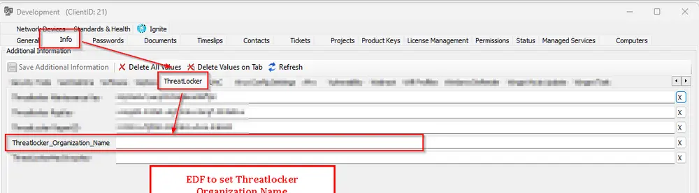

## Summary

This script installs the ThreatLocker agent on Windows and Mac operating systems.

## EDF Configuration

**For Windows Deployment:**

- Enter the Threatlocker Authorization key in System Properties under system property `ThreatLockerAuthKey` or `Threatlocker_Unique_Identifier` in the client-level EDF. Check [Tips](#tips)
- Enter the Organization name in Client EDF `Threatlocker_Organization_Name`
- Enter the Threatlocker Group ID in Client EDF `ThreatlockerGroupID`

  



**For MAC Deployment:**

- Enter Threatlocker Mac in Client EDF `ThreatLockerMacGroupKey`


## Sample Run

**First Run:**  
Set 'Set_Environment' to 1 to create system properties needed for the script.  


**General Execution:**  


## Dependencies

- [Internal Monitor: Deploy Threatlocker Agent](/docs/392a41e0-bbe1-4270-87a0-0a093aff3671)  
- [Solution: Threatlocker Agent Deployment](/docs/2b68cbb1-1406-4a4b-9173-e91f1b0c7f88)

## Global Parameters

| Name      | Example | Required | Description                                                                 |
|-----------|---------|----------|-----------------------------------------------------------------------------|
| Ticketing | 1       | False    | Set it to '1' to enable ticketing. Leave it blank or '0' to disable it.     |

## User Parameters

| Name           | Example | Required                        | Description                                                                                                 |
|----------------|---------|----------------------------------|-------------------------------------------------------------------------------------------------------------|
| Set_Environment| 1       | Need to set to 1 for first-time implementation | Running the script with the user parameter 'Set_Environment' as 1 will import System Properties and EDF's needed for the script. |

## System Properties

| Name                | Example                             | Required                | Description                                                                                                 |
|---------------------|-------------------------------------|-------------------------|-------------------------------------------------------------------------------------------------------------|
| ThreatLockerAuthKey | 322b9e5f-18d7-4acb-b333-ba1ab466f184  | True (For Windows Deployment) | The assigned ThreatLocker authorization key for Windows machines. Follow the instructions to get the group key for the desired machine. [Getting your Unique Identifier from ThreatLocker \| ThreatLocker Help Center](https://threatlocker.kb.help/getting-your-unique-identifier-from-threatlocker/) |

## Client-Level EDF

| Name                       | Type | Example         | Section     | Required                   | Description                                                                                                 |
|----------------------------|------|----------------|------------|----------------------------|-------------------------------------------------------------------------------------------------------------|
| Threatlocker_Organization_Name | Text | Proval | Threatlocker| True (For Windows Deployment) | Organization Name to be used for Threatlocker deployment. If deploying to an existing organization, that name must match the organization's name in the ThreatLocker portal. |
| Threatlocker_Unique_Identifier | Text | 565507f1-6451-4fa3-8cfb-8ac7d3f5a205 | Threatlocker| True (For Windows Deployment) | Unique Identifier of the direct parent organization. To override the value stored in `ThreatLockerAuthKey` Property. |
| ThreatLockerMacGroupKey    | Text | d976b4e1-7373-4032-8427-56fedfb35963 | Threatlocker| True (For MAC Deployment)  | Stores the Threatlocker Group key for Macintosh Machines. Follow the instructions to get the group key for the desired machine. [MAC Agent Group Key Location \| ThreatLocker Help Center (kb.help)](https://threatlocker.kb.help/mac-agent-group-key-location/) |
ThreatlockerGroupID   | Text | 78fd02a7-6190-4516-987d-11f3d79d7f51 | Threatlocker | True (For AMD Processors)  | Stores the ThreatLocker GroupID. This EDF was introduced to address deployment issues on AMD processors, as ThreatLocker does not get installed on them unless the GroupID is explicitly defined. |

## Location-Level EDF

| Name                | Type     | Section      | Required | Description                                                        |
|---------------------|----------|-------------|----------|--------------------------------------------------------------------|
| Exclude Threatlocker| Checkbox | Threatlocker| False    | Mark this EDF to exclude the Location from Threatlocker Deployment  |

## Computer-Level EDF

| Name                | Type     | Section      | Required | Description                                                        |
|---------------------|----------|-------------|----------|--------------------------------------------------------------------|
| Exclude Threatlocker| Checkbox | Threatlocker| False    | Mark this EDF to exclude the agent from Threatlocker |

## Tips

When to use `ThreatLockerAuthKey` (system property) vs `Threatlocker_Unique_Identifier` (client EDF)

- ThreatLockerAuthKey (system property)
  - Set this to the Unique Identifier of the top-level/main organization when the client you are deploying is a direct child of that main organization.
  - This is the default/global value the installer will use.

- Threatlocker_Unique_Identifier (client EDF)
  - Use this to override the system property for a specific client when that client belongs under an intermediate/sub-parent organization.
  - Set the EDF to the Unique Identifier of the sub-parent (the direct parent of the client) so the agent registers under the correct sub-organization.

Example (fictionalized for documentation)

- Main organization: Main (Unique Identifier: 9ed8c128-3cfb-4d2c-b352-5ced87622807)
  - Direct child: MainCorp Azure
  - Direct child: MainCorp Ops

- Sub-parent: Sub Group (Unique Identifier: 3472f4e4-31b4-45a6-9588-0e5b07924e9b)
  - Clients under this sub-parent:
    - Abc Services
    - Xyz LLC
    - Pqr Insurance

How to apply:

- If the target client is MainCorp Azure (direct child of MainCorp), save MainCorp's Unique Identifier in the `ThreatLockerAuthKey` system property.
- If the target client is Abc Services (falls under the Sub Group sub-parent), set the client EDF `Threatlocker_Unique_Identifier` to the Sub Group Unique Identifier (3472f4e4-31b4-45a6-9588-0e5b07924e9b). Do not change the global ThreatLockerAuthKey unless you want to change the default for all direct children.

Summary rule:

- If the organization for which you want to deploy falls directly under a sub-parent, save the sub-parent's Unique Identifier to the client EDF (`Threatlocker_Unique_Identifier`). - If it falls directly under the main/top-level organization, save the main organization's Unique Identifier to the `ThreatLockerAuthKey` system property.

## Ticketing

**Subject:** `Threatlocker Deployment Failed for %ClientName%\%ComputerName% at %LocationName%`

**Ticket Body for Download Failure:**

**For 32-bit:**

```PlainText
Failed to download Threatlocker installer.
Please ensure that the following download URL is reachable from the computer: 
https://api.threatlocker.com/updates/installers/ThreatLockerStubX86.exe
```

**For 64-bit:**

```PlainText
Failed to download Threatlocker installer.
Please ensure that the following download URL is reachable from the computer: https://api.threatlocker.com/updates/installers/ThreatLockerStubX64.exe
```

**Ticket Body for Installation Failure:**  

```PlainText
Failed to install Threatlocker
Command Result: %shellresult%
```

**Ticketing parameter should be set to '1' in the Global Parameters of the script to enable the ticket creation feature.**  


TicketCreationCategory can be set from the alerting tab of the Internal Monitor [Deploy Threatlocker Agent](/docs/392a41e0-bbe1-4270-87a0-0a093aff3671).  

