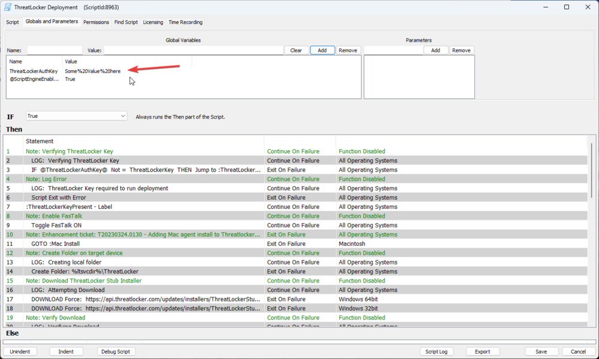
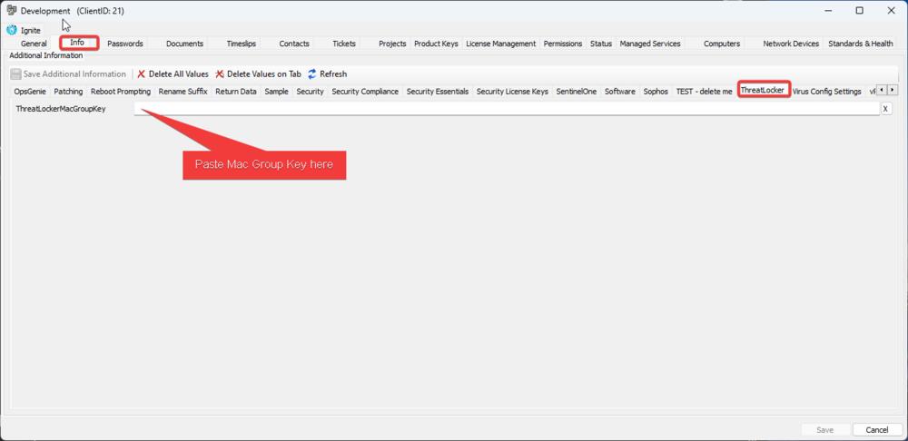
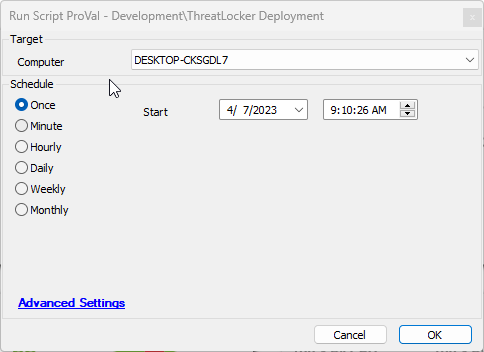

## Summary

This document provides a guide for installing the ThreatLocker application on both Windows and Mac operating systems.

## Sample Run

You will need to enter your ThreatLocker group key here for Windows operating systems:  

For Mac deployment, you will need to follow these steps:

- Follow the instructions to obtain the group key for the desired machine. [MAC Agent Group Key Location | ThreatLocker Help Center (kb.help)](https://threatlocker.kb.help/mac-agent-group-key-location/)
- Copy the group key and set this EDF for the client.  

Then run the script:  

#### Global Parameters

| Name                     | Example                          | Required | Description                              |
|--------------------------|----------------------------------|----------|------------------------------------------|
| ThreatLockerAuthKey      | gfjhdsiopghg-nfdo;hgdf-jdskfl; | True     | The assigned ThreatLocker authorization key. |

## Output

- Script log

