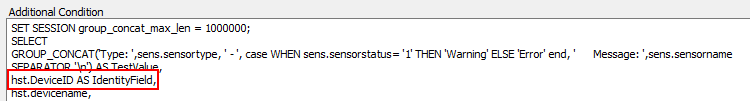

## Summary

This script is a complete ticket creation script designed exclusively for the ESXi Bad Sensor Monitor.

## Monitor Driven Only

This script is intended to be monitor-driven only and should never be run manually. If it is executed manually, the script will simply exit at the first step in the else section.

## Dependencies

The only dependency for this script is that the monitor triggering the script must report the network device ID as the field name. The script will gather all other necessary information.

## Process

1. Gather information based on the network device ID reported by the monitor.
2. Create a ticket for ESXi Bad Sensors, listing them accordingly.

## Example Ticket

> The ESXi Host named \<ESXi HostName> at \<Client>/\<Location> is currently reporting 4 Bad Sensors.  
>  
> The ESXi Host information is outlined below:  
> Host Name: \<computername>  
> ESXi Version: VMware ESXi 6.7.0  
> Host Make/Model: HPE ProLiant DL380 Gen10  
> S/N of Host: \<Serial Number of Host>  
>  
> There is 1 reported VM running on this host, displayed below:  
> \<VM Name>  
>  
> The failing sensors have been listed below:  
> Type: Storage - Error      Message: Disk 1 on HPSA1: Port Box 0 Bay 0: 0GB: Unconfigured Disk: Disk Error  
> Type: Storage - Error      Message: Disk 2 on HPSA1: Port Box 0 Bay 0: 0GB: Unconfigured Disk: Disk Error  
> Type: Storage - Error      Message: Disk 3 on HPSA1: Port Box 0 Bay 0: 0GB: Unconfigured Disk: Disk Error  
> Type: Storage - Error      Message: Disk 4 on HPSA1: Port Box 0 Bay 0: 0GB: Unconfigured Disk: Disk Error  

