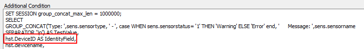

## Summary

This script is a complete ticket creation script designed specifically for the ESXi Host Not Communicating for more than 3 Days.

## Monitor Driven Only

This script is intended to be monitor-driven only and should never be run manually. If it is executed manually, the script will simply exit at the first step in the else section.

## Dependencies

The only dependency for this script is that the monitor triggering the script must have the network deviceID reported as the field name. The script will gather all other required information on its own.

## Process

1. Gather information based on the network deviceID that the monitor has reported.
2. Create a ticket for the ESXi host, indicating that the host has not updated its inventory for an extended period.

## Example Ticket

> The ESXi Host named \<ESXi Host Name> at \<Client>/\<Location> has not checked into Automate for over 3 days. Please ensure that the probe is correctly installed at the location \<Location> and that the server is still online and in use. If the server is no longer active, deleting the network device associated with the ESXi server will remove it from monitoring.
>
> The ESXi Host information is outlined below:  
> Host Name: \<ESXi Host Name>  
> ESXi Version: VMware ESXi 6.7.0  
> Host Make/Model: HPE ProLiant DL380 Gen10  
> S/N OF Host: \<ESXi Serial Number>  
> Last Check-In: 5/31/2022 11:33:54 AM  
> Network Device ID: \<Device ID>
>
> There is 1 reported VM running on this host, which is displayed below:  
> \<VM Name>

