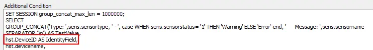

## Summary

This script is a complete ticket creation script intended only for use with the ProVal - Production - ESXi Storage Space \< 10% Monitor.

## Monitor Driven Only

This script is designed to be monitor-driven only and should never be manually run. If it is manually run, the script will simply exit at the first step in the else section.

## Dependencies

The only dependency for this script is that the monitor triggering the script must have the network deviceID reported as the field name. The script will gather all other necessary information.

## Process

1. Gather information based on the network deviceID reported by the monitor.
2. Create a ticket for ESXi low storage space, listing all relevant details accordingly.

## Example Ticket

> The ESXi Host named @ESXHostName@ at %CLIENTNAME%/%LocationName% is reporting low disk space.  
>
> The ESXi Host information is outlined below:  
> Host Name: \<ESXi Host Name>  
> ESXi Version: VMware ESXi 6.7.0  
> Host Make/Model: HPE ProLiant DL380 Gen10  
> S/N OF Host: \<ESXi Serial Number>  
> Last Check-In: 5/31/2022 11:33:54 AM  
> Network Device ID: \<Device ID>  
>
> There is 1 reported VM running on this host, displayed below:  
> \<VM Name>  
>
> \<Datastores with low disk space listed here>