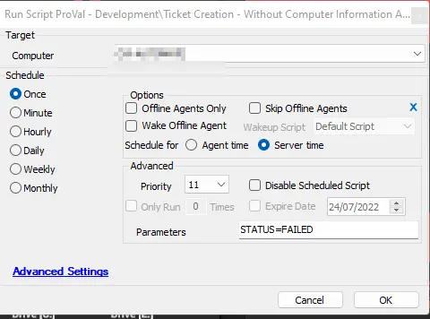

## Summary

This script operates similarly to the [CWM - Automate - Script - Ticket Creation - Computer](/docs/63beba3c-f4a6-41a5-98e2-d4e4ce885035) script; however, instead of creating a ticket with the computer's details, it will create a ticket without including them. Additionally, no actions are defined in the script for the SUCCESS status of the monitors.

## Sample Run

This is an Autofix Script, and it is currently being used with the “~Custom Ticket Creation without Computer Details” alert template.

## Variables

| Name                    | Description                                                                                              |
|-------------------------|----------------------------------------------------------------------------------------------------------|
| Monitor                 | Name of the monitor set                                                                                  |
| RAWSQL                  | To verify whether the script was called by a RAWSQL monitor set                                         |
| Dataout                 | Monitor set's statement, if it's written as RAWSQL                                                      |
| FIELDNAME               | Monitor set's identity field                                                                              |
| Result                  | Monitor set's test value                                                                                 |
| TicketSubject           | Subject from the alerting tab of the monitor set                                                         |
| SuccessMSG              | Success message from the alerting tab of the monitor set                                                |
| FailedMSG               | Failure message from the alerting tab of the monitor set                                                 |
| TicketCreationCategory   | Ticket category to assign to the ticket                                                                   |
| TicketCreateSubject      | Ticket subject                                                                                             |
| TicketCreateBody         | Failure message                                                                                           |
| TicketComment            | Failure message                                                                                           |
| DataoutLength           | Position of the last parentheses in the monitor set's query; this is calculated to remove `(select computerid from tcomp)` from the monitor set's statement. Keeping this statement will lead to the script's failure. |

## Process

1. Verifies whether it is a RAWSQL monitor set or a normal internal monitor.
2. Stores the SQL query used in the monitor set to the `Dataout` variable. It also replaces 'from tcomp' with 'from computers', if it exists in the SQL query. To perform this replacement, it converts the entire query to lowercase.
3. Finds the `FieldName`, `TicketSubject`, `SuccessMSG`, and `FailedMSG`.
4. Uses Automate's default "_System Automation/Functions/Ticket Comment" script to create a ticket. To call that script, the `TicketCreateSubject`, `TicketCreateBody`, and `TicketComment` variables must be defined and are set with the values of `TicketSubject`, `FailedMSG`, and `FailedMSG` variables, respectively.

The script will add a comment if an open ticket for the computer with the same subject already exists. Otherwise, it will create one.

## Output

- Ticket
