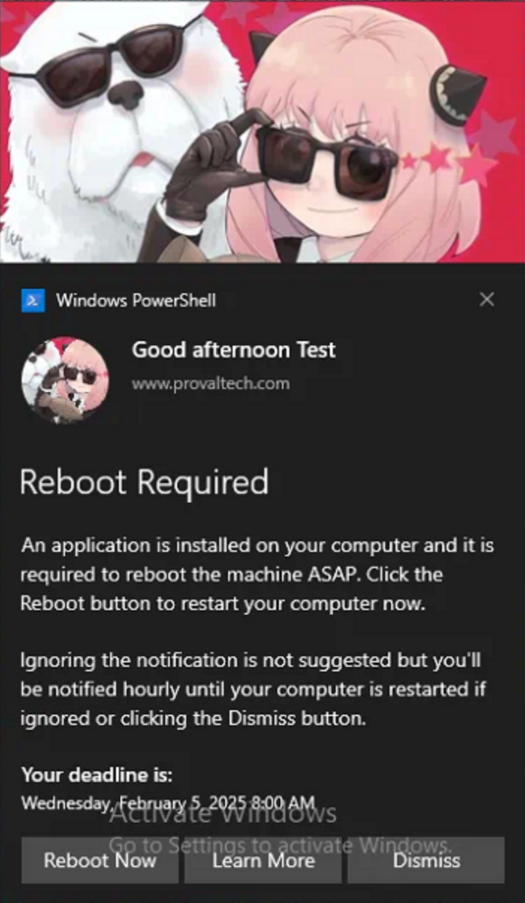
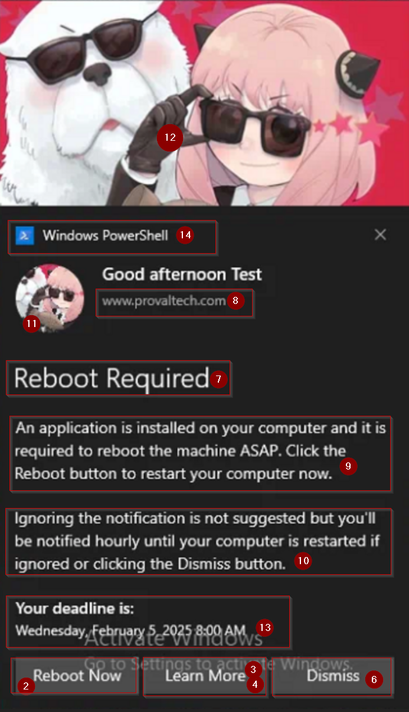

## Summary
This is a copy-only template for clients to use to set up toast notifications. The script is a template with example variables. Ensure each variable is reviewed and adjusted as needed before incorporating them into a production script.

## Sample Run
This Script is not intended to be run, it is intended to be a template that can be copied to any script that a toast notification is desired.

## Use Case
Recommended steps to use Toast Notification:
1. Open the `Toast Notification - Template` script in ConnectWise Automate
2. Select all lines in the ELSE section of that script
3. Paste these lines in any script where a toast notification is desired
4. Enable any required lines and set the desired values.

**NOTE:** Then Section of this script is intentionally left blank.

## Dependencies
[Toast Notification](/docs/3aab837d-cb64-4669-aa35-040cce21c575)

[Invoke-ToastNotification](/docs/426118d9-ff83-444e-9744-30a0e26cb490)

## Variables

| Name                        | Description                                                                                                                                         |
|-----------------------------|-----------------------------------------------------------------------------------------------------------------------------------------------------|
| `NotificationType`          | The type of notification to send. The accepted values for `NotificationType` are: <ul><li>**Generic:** Enables a static, generic toast notification.</li><li>**PendingRebootUptime:** Displays a toast notification reminding users to restart their system after exceeding the maximum uptime.</li><li>**PendingRebootCheck:** Displays a toast notification when a pending reboot is detected through the system registry or WMI.</li><li>**ADPasswordExpiration:** Sends a toast notification to users when their Active Directory password is nearing expiration.</li></ul> It is a mandatory variable. |
| `RebootButton`              | Set `RebootButton` to 1 to enable the `Reboot` button in the notification. Setting it to `0` or deleting the variable will disable it. `RebootButton` is available for `Generic`, `PendingRebootUptime`, and `PendingRebootCheck` notification types. |
| `LearnMoreButton`           | Set `LearnMoreButton` to 1 to enable the `Learn More` button in the notification. Setting it to `0` or deleting the variable will disable it.             |
| `LearnMoreUrl`              | Set the URL to navigate by clicking the `Learn More` button in the notification. `LearnMoreButton` should be enabled or set to `1` to allow the `LearnMoreUrl` variable.                                                    |
| `SnoozeButton`              | Set `SnoozeButton` to 1 to enable the `Snooze` button in the notification. Setting it to `0` or deleting the variable will disable it. The `LearnMoreButton` and the `SnoozeButton` cannot be enabled simultaneously.       |
| `DismissButtonText`         | Set the string in the `DismissButtonText` variable to customize the dismiss button's text. Delete the variable or leave it blank to return to the default value, `Dismiss`.                                                     |
| `TitleText`                 | Sets the title of the notification in the `TitleText` variable. It is mandatory to set this variable.                                               |
| `AttributionText`           | Sets the attribution text in the `AttributionText` variable. It can be a company name or website, for authenticity.                                 |
| `BodyText1`                 | `BodyText1` stores the main text content of the notification body. It is a mandatory variable.                                                      |
| `BodyText2`                 | `BodyText2` stores the secondary text content of the notification body.                                                                             |
| `LogoImage`                 | `LogoImage` stores the URL or local path for the logo image in the notification. Clear or remove the variable to generate the notification with the default logo.                                                               |
| `HeroImage`                 | `HeroImage` stores the URL or local path for the primary image in the notification. Clear or remove the variable to generate the notification with the default image.                                                           |
| `Deadline`                  | `Deadline` stores the deadline for the notification in the format yyyy-MM-dd HH:mm:ss. To avoid prompting any deadline, the variable can either be deleted or left blank.                                                       |
| `NotificationAppName`       | `NotificationAppName` specifies the name of the application that will display the notification. Delete the variable or leave it blank to fall back to the default value. The default value is `Windows PowerShell`.              |
| `MaxUptimeDays`             | `MaxUptimeDays` stores the maximum uptime (in days) for the PendingRebootUptime parameter. The default is 30 days. `MaxUptimeDays` is available for the `PendingRebootUptime` notification type. Delete the variable or leave it blank to fall back to the default value. |
| `ADPasswordExpirationDays`  | `ADPasswordExpirationDays` stores the number of days before password expiration when reminders should start. The default is 7 days. `ADPasswordExpirationDays` is available for the `ADPasswordExpiration` notification type. Delete the variable or leave it blank to fall back to the default value. |
| `Repeat`                    | `Repeat` specifies how frequently the notification should repeat. Options: Once, Hourly, XXMinutes, XXHours, Daily, XXDays. Delete the variable or leave it blank to fall back to the default value. The default is `Once`.      |

## Example

### Variables

| ID  | Name                     | Value                                                                                                                                               |
|-----|--------------------------|-----------------------------------------------------------------------------------------------------------------------------------------------------|
| 1   | NotificationType         | Generic                                                                                                                                             |
| 2   | RebootButton             | 1                                                                                                                                                   |
| 3   | LearnMoreButton          | 1                                                                                                                                                   |
| 4   | LearnMoreUrl             | https://www.provaltech.com                                                                                            |
| 5   | SnoozeButton             | 0                                                                                                                                                   |
| 6   | DismissButtonText        | Dismiss                                                                                                                                             |
| 7   | TitleText                | Reboot Required                                                                                                                                     |
| 8   | AttributionText          | www.provaltech.com                                                                                                     |
| 9   | BodyText1                | An application is installed on your computer and it is required to reboot the machine ASAP. Click the Reboot button to restart your computer now.   |
| 10  | BodyText2                | Ignoring the notification is not suggested but you'll be notified hourly until your computer is restarted if ignored or clicking the Dismiss button.|
| 11  | LogoImage                | https://labtech.provaltech.com/labtech/transfer/images/alogo.jpg                                                                           |
| 12  | HeroImage                | https://labtech.provaltech.com/labtech/transfer/images/alogo.jpg                                                                          |
| 13  | Deadline                 | 2025-02-05 08:00:00                                                                                                                                 |
| 14  | NotificationAppName      |                                                                                                                                                     |
| 15  | MaxUptimeDays            | 0                                                                                                                                                   |
| 16  | ADPasswordExpirationDays | 0                                                                                                                                                   |
| 17  | Repeat                   | 60Minutes                                                                                                                                           |

## Outcome

#### Notification

#### Scheduled Task

### Affected Areas on Prompt Based on Example Variables

