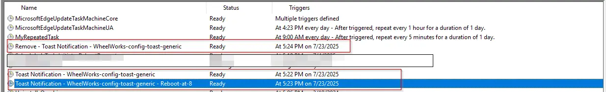

## Summary

This is a copy-only template for clients to use to set up toast notifications. The script is a template with example variables. Ensure each variable is reviewed and adjusted as needed before incorporating them into a production script.

## Sample Run

This Script is not intended to be run, it is intended to be a template that can be copied to any script that a toast notification is desired.

## Use Case

Recommended steps to use Toast Notification:

1. Open the `Toast Notification - Template` script in ConnectWise Automate  
2. Select all lines in the ELSE section of that script  
3. Paste these lines in any script where a toast notification is desired  
4. Enable any required lines and set the desired values.  

**NOTE:** Then Section of this script is intentionally left blank.

## Dependencies

[Toast Notification](/docs/3aab837d-cb64-4669-aa35-040cce21c575)

[Invoke-ToastNotification](/docs/426118d9-ff83-444e-9744-30a0e26cb490)

## Variables

| Name                        | Description                                                                                                                                         |
|-----------------------------|-----------------------------------------------------------------------------------------------------------------------------------------------------|
| NotificationType            | The type of notification to send. The accepted values for @NotificationType@ are generic, PendingRebootUptime, PendingRebootCheck, and ADPasswordExpiration. It is a mandatory variable. <ul><li>**Generic:** Enables a static, generic toast notification.</li><li>**PendingRebootUptime:** Displays a toast notification reminding users to restart their system after exceeding the maximum uptime.</li><li>**PendingRebootCheck:** Displays a toast notification when a pending reboot is detected through the system registry or WMI.</li><li>**ADPasswordExpiration:** Sends a toast notification to users when their Active Directory password is nearing expiration.</li></ul> |
| RebootButton                | Set @RebootButton@ to 1 to enable the `Reboot` button in the notification. Setting it to `0` or deleting the variable will disable it. @RebootButton@ is available for `Generic`, `PendingRebootUptime`, and `PendingRebootCheck` notification types. |
| RunScriptButton | Set @RunScriptButton@ to 1 to enable the 'Run Script' button in the notification. To disable it, either set the value to 0 or remove the variable. Please note that enabling this button will automatically disable the 'Snooze' button. |
| RunScriptButtonText | Set the string in the @RunScriptButtonText@ variable to customize the text of the RunScript button. Delete the variable or leave it blank to fall back to the default value. The default is `RunScript`. `@RunScriptButton@` should be enabled or set to `1` to enable the `@RunScriptButtonText@` variable. |
| ScriptPath | @ScriptPath@ specifies the full path to a PowerShell script (.ps1) that will be executed when the 'RunScript' button is clicked. This must be a valid path ending in .ps1. Setting this variable is mandatory if @RunScriptButton@ is enabled. If @RebootScriptButton@ is not enabled, this variable can be omitted by leaving it blank or removing it entirely. |
| ScriptContext | @ScriptContext@ Specifies the context in which the custom script should be executed when triggered from the notification on clicking the 'RunScript' button. Valid values are 'User' (runs in the current user context) or 'System' (runs with elevated/system privileges, if supported). Default is 'User'. `@RunScriptButton@` should be enabled or set to `1` to enable the `@ScriptContext@` variable. |
| ScriptStyle | @ScriptStyle@ defines how the script should be executed when the 'RunScript' button is clicked. Valid options are 'Interactive' (displays messages or launches installers on the user's desktop) and 'Hidden' (runs silently in the background). The default value is 'Hidden'. This variable is only applicable if @RunScriptButton@ is enabled or set to 1. |
| LearnMoreButton             | Set @LearnMore@ to 1 to enable the `Learn More` button in the notification. Setting it to `0` or deleting the variable will disable it.             |
| LearnMoreUrl                | Set the URL to navigate by clicking the `Learn More` button in the notification. `@LearnMoreButton@` should be enabled or set to `1` to allow the `@LearnMoreUrl@` variable.                                                    |
| SnoozeButton                | Set @SnoozeButton@ to 1 to enable the 'Snooze' button in the notification. To disable it, either set the value to 0 or remove the variable entirely. Note that @SnoozeButton@ and @LearnMoreButton@ cannot be enabled at the same time. Additionally, enabling @RebootScriptButton@ will automatically disable the @SnoozeButton@. |
| HideDismissButton | Set @HideDismissButton@ to 1 to remove the dismiss button from the toast notification. When enabled, users will not see an option to dismiss the notification. By default, the dismiss button is visible. |
| DismissButtonText           | Set the string in the @DismissButtonText@ variable to customize the dismiss button's text. Delete the variable or leave it blank to return to the default value, `Dismiss`.                                                     |
| TitleText                   | Sets the title of the notification in the @TitleText@ variable. It is mandatory to set this variable.                                               |
| AttributionText             | Sets the attribution text in the @AttributionText@ variable. It can be a company name or website, for authenticity.                                 |
| BodyText1                   | @BodyText1@ stores the main text content of the notification body. It is a mandatory variable.                                                      |
| BodyText2                   | @BodyText2@ stores the secondary text content of the notification body.                                                                             |
| LogoImage                   | @LogoImage@ stores the URL or local path for the logo image in the notification. Clear or remove the variable to generate the notification with the default logo.                                                               |
| HeroImage                   | @HeroImage@ stores the URL or local path for the primary image in the notification. Clear or remove the variable to generate the notification with the default image.                                                           |
| Deadline                    | @Deadline@ stores the deadline for the notification in the format yyyy-MM-dd HH:mm:ss. To avoid prompting any deadline, the variable can either be deleted or left blank.                                                       |
| NotificationAppName         | @NotificationAppName@ specifies the name of the application that will display the notification. Delete the variable or leave it blank to fall back to the default value. The default value is `Windows PowerShell`              |
| MaxUptimeDays               | @MaxUptimeDays@ stores the maximum uptime (in days) for the PendingRebootUptime parameter. The default is 30 days. @MaxUptimeDays@ is available for the `PendingRebootUptime` notification type. Delete the variable or leave it blank to fall back to the default value. |
| ADPasswordExpirationDays    | @ADPasswordExpirationDays@ stores the number of days before password expiration when reminders should start. The default is 7 days. The default is 30 days. @ADPasswordExpirationDays@ is available for the `ADPasswordExpiration` notification type. Delete the variable or leave it blank to fall back to the default value. |
| Repeat                      | @Repeat@ specifies how frequently the notification should repeat. Options: Once, Hourly, XXMinutes, XXHours, Daily, XXDays. Delete the variable or leave it blank to fall back to the default value. The default is `Once`.      |
| MaxOccurrences              | @MaxOccurrences@ specifies the maximum number of notifications to send before the scheduled task is automatically removed. This works in conjunction with the @Repeat@ parameter, except when @Repeat@ is set to `Once`.      |

## Example

### Variables

| ID  | Name                     | Value                                                                                                                                               |
|-----|--------------------------|-----------------------------------------------------------------------------------------------------------------------------------------------------|
| 1   | NotificationType         | Generic                                                                                                                                             |
| 2   | RebootButton             | 1                                                                                                                                                   |
| 3   | LearnMoreButton          | 1                                                                                                                                                   |
| 4   | LearnMoreUrl             | https://www.provaltech.com                                                                                            |
| 5   | SnoozeButton             | 0                                                                                                                                                   |
| 6   | DismissButtonText        | Dismiss                                                                                                                                             |
| 7   | TitleText                | Reboot Required                                                                                                                                     |
| 8   | AttributionText          | www.provaltech.com                                                                                                     |
| 9   | BodyText1                | An application is installed on your computer and it is required to reboot the machine ASAP. Click the Reboot button to restart your computer now.   |
| 10  | BodyText2                | Ignoring the notification is not suggested but you'll be notified hourly until your computer is restarted if ignored or clicking the Dismiss button.|
| 11  | LogoImage                | https://labtech.provaltech.com/labtech/transfer/images/alogo.jpg                                                                           |
| 12  | HeroImage                | https://labtech.provaltech.com/labtech/transfer/images/alogo.jpg                                                                          |
| 13  | Deadline                 | 2025-02-05 08:00:00                                                                                                                                 |
| 14  | NotificationAppName      |                                                                                                                                                     |
| 15  | MaxUptimeDays            | 0                                                                                                                                                   |
| 16  | ADPasswordExpirationDays | 0                                                                                                                                                   |
| 17  | Repeat                   | 60Minutes                                                                                                                                           |
| 18  | MaxOccurrences           |                                                                                                                   |

### Outcome

#### Notification

#### Scheduled Task

### Affected Areas on Prompt Based on Example Variables

## Example

### Variables

| ID  | Name                     | Value                                                                                                                                               |
|-----|--------------------------|-----------------------------------------------------------------------------------------------------------------------------------------------------|
| 1   | NotificationType         | Generic                                                                                                                                             |
| 2   | RebootButton             | 1                                                                                                                                                   |
| 3   | RunScriptButton          | 1  |
| 4   | RunScriptButtonText      | Reboot at 8 |
| 5   | ScriptPath               | C:\ProgramData\_Automation\Script\Rebootat8\Rebootat8.ps1 |
| 6   | ScriptContext            | System |
| 7   | ScriptStyle              | Hidden |
| 8   | LearnMoreButton          | 1                                                                                                                                                   |
| 9   | LearnMoreUrl             | https://en.wikipedia.org/wiki/Hamster                                                                                          |
| 10  | HideDismissButton        | 1                                                                                                                                             |
| 11   | TitleText                | Hamster Overload Detected!                                                                                                                          |
| 12  | AttributionText          | www.provaltech.com                                                                                                     |
| 13  | BodyText1                | The tiny hamster powering your computer is absolutely exhausted and needs a magical nap to keep things running smoothly! Please be kind, click 'Reboot Now' to give it a break, or choose 'Reboot at 8' to let it rest later tonight.   |
| 14  | BodyText2                | If you ignore this plea, the hamster will take matters into its own tiny paws and force a nap at 8 PM anyway. Let's not push our luck with a tired rodent on a wheel!. |
| 15  | LogoImage                | C:\ProgramData\_Automation\Script\Rebootat8\magicalHamster.png                                                                           |
| 16  | HeroImage                | C:\ProgramData\_Automation\Script\Rebootat8\runningHamster.png                                                                        |
| 17  | NotificationAppName      | WheelWorks                                                                                                                                                |
| 18  | Repeat                   | Once                                                                                                                                           |
| 19  | MaxOccurrences           | 1                                                                                                                  |

### Outcome

#### Notification

#### Scheduled Task

### Reboot at 8

### Affected Areas on Prompt Based on Example Variables

