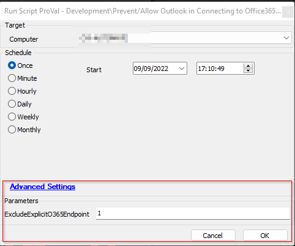

## Summary

Microsoft launched the **“Direct Connect to Office365 Feature”** (Outlook 2016 version 16.0.6741.2017 and higher) that forces Outlook 2016 to connect to Office365 when:

- Users are not yet active in Office365 and do not have a mailbox provisioned due to the Exchange license assigned.
- *Autodiscover* is not working on the source server.
- The connection between the computer and the source server is interrupted or blocked by a firewall/antivirus.

This feature is beneficial as it automatically detects your Office365 account; however, it can also pose significant problems during the migration process to Office365.

When this occurs, email continues to work; however, the user will not receive any emails in Outlook since it is connected to Office365; they will receive them on their respective source server.

*See this article for more information about the “Direct Connect To Office365” Feature:* [Unexpected Autodiscover Behavior](https://docs.microsoft.com/en-us/office365/troubleshoot/administration/unexpected-autodiscover-behavior)

The script can be used to create a user-level registry key for all users to prevent this behavior or to reset it back to normal.

Please ensure that the "ExcludeExplicitO365Endpoint" parameter has the correct value. A value of 1 will "Prevent Outlook from Connecting to an Office 365 Account," while a value of 0 will "Allow Outlook to Connect to an Office 365 Account."

## Sample Run

## Variables

| Name    | Description                                                  |
|---------|--------------------------------------------------------------|
| OutCome | Output of the PowerShell script writing the registry value   |

#### User Parameters

| Name                       | Example | Required | Description                                                                                                                                                     |
|----------------------------|---------|----------|-----------------------------------------------------------------------------------------------------------------------------------------------------------------|
| ExcludeExplicitO365Endpoint | 1       | True     | Represents the action you would like to perform with the script. A value of 1 will "Prevent Outlook from Connecting to an Office 365 Account," while a value of 0 will "Allow Outlook to Connect to an Office 365 Account." |

## Process

1. Verify the value passed to the ExcludeExplicitO365Endpoint parameter. 
2. Execute the PowerShell script to modify/add the registry key.
3. Log the output of the script.

## Output

Script Log

