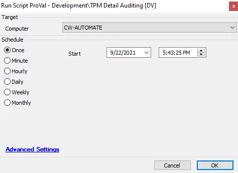

## Summary

This script provides detailed information about the TPM configuration on the endpoint.

**Time Automation:** 10 Minutes

## Sample Run

## Dependencies

[TPM Detailed Info](/docs/3210ea64-6a5d-416d-aea8-8e5399c0e62c)

## Variables

| Variable              | Description                                                   |
|-----------------------|---------------------------------------------------------------|
| TPMData               | Collects the complete TPM information                         |
| TPMReady              | Indicates whether TPMReady is enabled or disabled             |
| TPMPresent            | Indicates whether TPMPresent is enabled or disabled           |
| ManagedAuthLevel      | Stores the ManagedAuthLevel information                       |
| OwnerAuth             | Stores the OwnerAuth information                              |
| OwnerClearDisabled    | Indicates whether OwnerClear is disabled or not               |
| AutoProvisioning      | Indicates whether auto-provisioning is enabled or not        |
| LockedOut             | Indicates whether TPM is locked or not                        |
| TPMVersion            | Provides the TPM version information                          |

#### Script States

| Name                   | Example                                                                                                      | Description                                               |
|------------------------|--------------------------------------------------------------------------------------------------------------|-----------------------------------------------------------|
| TPMDetail_Info         | @TPMReady@ -- @TPMPresent@ -- @ManagedAuthLevel@ -- @OwnerAuth@ -- @OwnerClearDisabled@ -- @AutoProvisioning@ -- @LockedOut@ -- @TPMVersion@ | Stores the TPM data to be displayed in the dataview.     |

## Process

- The PowerShell script gathers the relevant TPM details.
- It stores the output of the PowerShell script to a script state. This data is then visible in the [TPM Detailed Info](/docs/3210ea64-6a5d-416d-aea8-8e5399c0e62c) dataview.

## Output

- Script log
- Script state
- Dataview