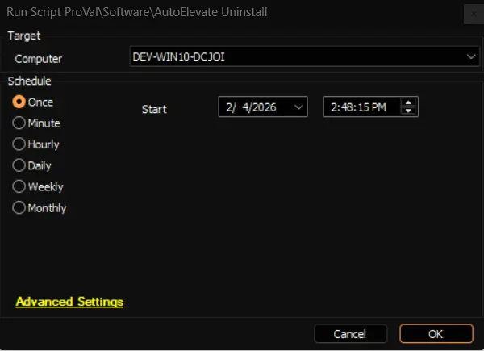

## Summary

Since AutoElevate agents are updated on a continual basis we DO NOT RECOMMEND UNINSTALLATION VIA SCRIPT IF THE AGENT HAS BEEN INSTALLED FOR ANY LENGTH OF TIME AND IS BEING REPORTED IN THE AE ADMIN PORTAL. TO INITIATE AN UNINSTALL AE RECOMMENDS USING THE AE ADMIN PORTAL AS DESCRIBED BELOW.

If an uninstall of the agent is necessary we recommend uninstalling by "deleting" the computer from the AutoElevate Admin Portal (https://msp.autoelevate.com ). This will remove the computer from the Admin Portal and will also initiate an uninstall of the AE Agent. To "delete" the computer go to the Computers screen in the AE Admin Portal and then click the trash can icon next to the computer or select the computer(s) and click the "Actions" menu and "Delete". 

If an installation of agent has taken place but has not shown up in the Admin Portal (make sure you are looking at current data by clicking the 'refresh data button' at the top right corner of the computers screen) and also is confirmed to be installed on the target machine you can use the AutoElevate Uninstall script to initiate uninstallation from Automate.

## Sample Run

## Output

- Script log