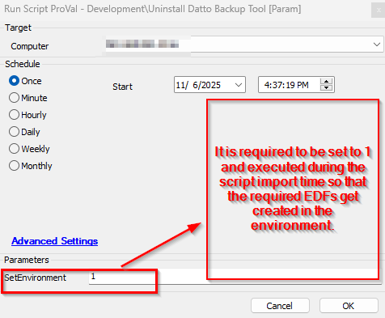
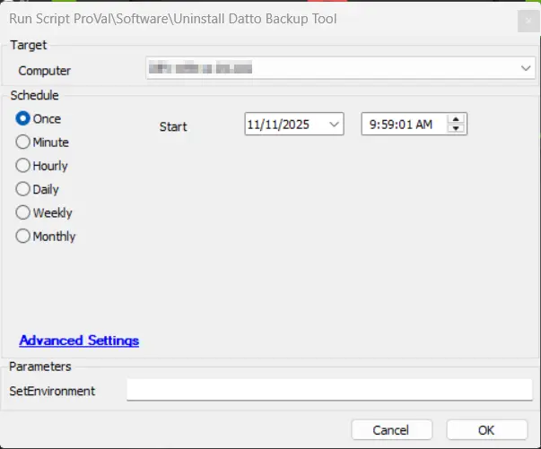

## Summary
This script uninstalls the Datto Windows Agent or Datto Cloud Continuity or both, depending on the option selected at the `Uninstall Datto Backup tool` client-level EDF. It then grabs the quietuninstallstring from the registry of the installed application.

## Sample Run

## Dependencies

## Process

- It checks if the agent has Datto Windows Agent or Datto Cloud Continuity or both installed, depending on the option selected at the `Uninstall Datto Backup tool` client-level EDF.
- If detected, then it writes a PS1 on the agent with a MD5 file hash "0DAFD4820F6D5871A28357EC7A980195" or a SHA256 Hash "80E436DEA2AF5FFE4EF8141CD4595BAAA305519EF265B9EEC663CF24F074BF62" that can be used to whitelist if any third-party blocking application is installed in the environment that can restrict the PowerShell execution.
- The PS1 fetches the quiet uninstall command from the application registry and executes it using the system account, and uninstalls the application.
- It includes proper error handling

## Output

- Script Log