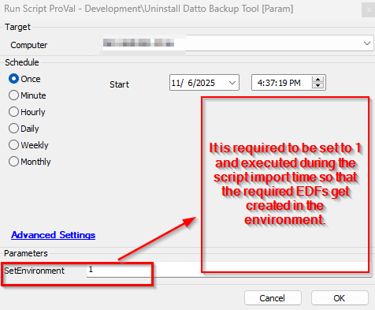
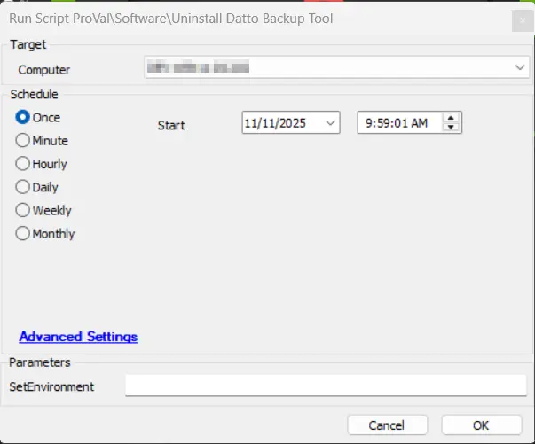
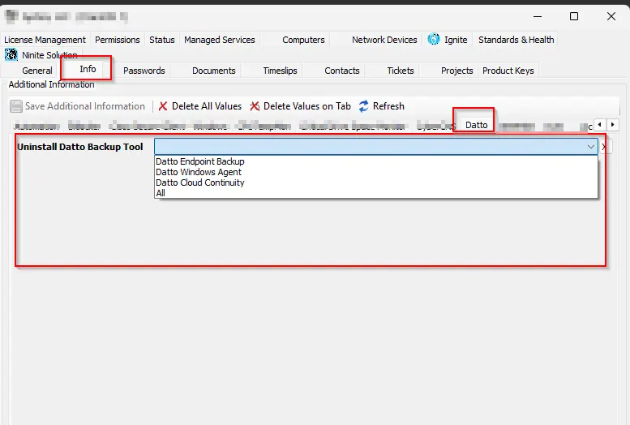
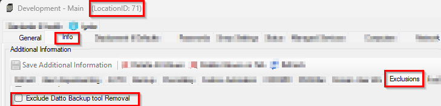
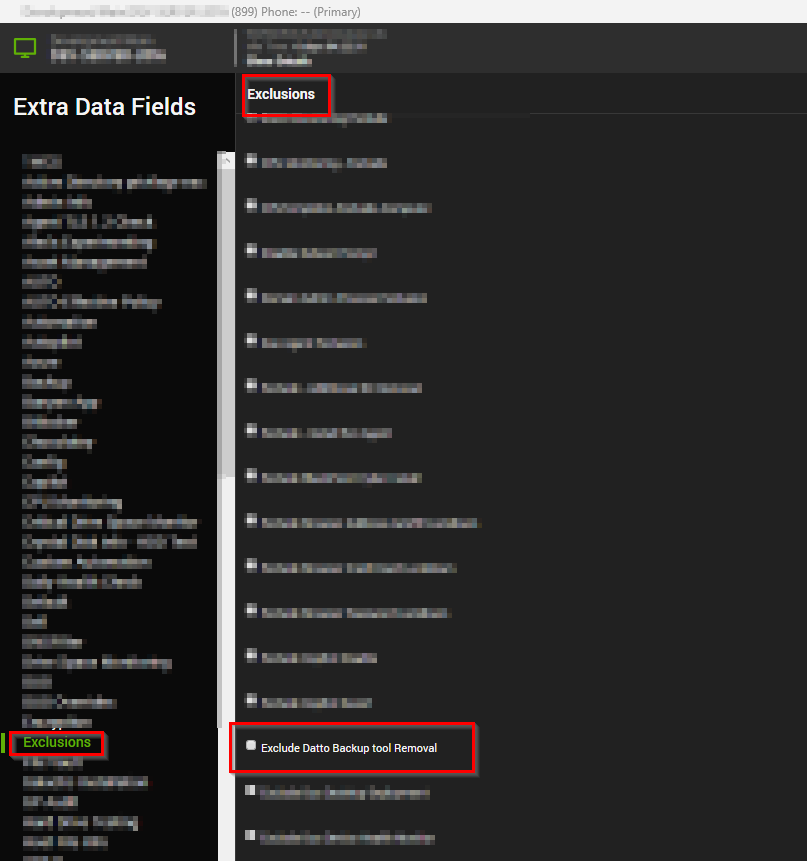

## Summary
This script uninstalls the Datto Endpoint Backup, Datto Windows Agent or Datto Cloud Continuity or all, depending on the option selected at the `Uninstall Datto Backup Tool` client-level EDF. It then grabs the quietuninstallstring from the registry of the installed application.

## Sample Run

**First Run:** Execute the script with the user parameter `SetEnvironment` as 1 to import the EDFs needed for the script.    

  

**Regular Run:**  

## Dependencies

[Solution - Uninstall Datto Backup Tool](/docs/cd3e8104-0edb-4bcf-933c-eb8d6e3b5022)

## EDFs

| Name | Level | Type | Section | Description |
| --------- | --------- | ------------ | --------- | -------------------------------------------- |
| `Uninstall Datto Backup tool` | Client | Drop-down | Datto | This dropdown allows to select the  `Datto Endpoint Backup`, `Datto Windows Agents` or `Datto Cloud Continuity` or `All` for uninstallation |
| `Exclude Datto Backup tool Removal` | Location | Checkbox | Exclusions | This excludes the location from the uninstallation of Datto backup tools.  |
|`Exclude Datto Backup tool Removal` | Computer | Checkbox | Exclusions | This exclude the computer from the uninstallation of Datto backup tools. |

## Process

- It checks if the agent has  `Datto Endpoint Backup`, `Datto Windows Agent` or `Datto Cloud Continuity` or all of these installed, depending on the option selected at the `Uninstall Datto Backup Tool` client-level EDF.
- If detected, then it writes a PS1 on the agent with file hashes (shown above) that can be used to whitelist if any third-party blocking application is installed in the environment that can restrict the PowerShell execution.
- The PS1 fetches the quiet uninstall command from the application registry and executes it using the system account, and uninstalls the application along with proper error handling

## Output

- Script Log

## Changelog

### 2026-05-19

- Updated the solution to uninstall `Datto Endpoint Backup` as well.
- Code signed the script.

### 2025-11-06

- Initial version of the document
