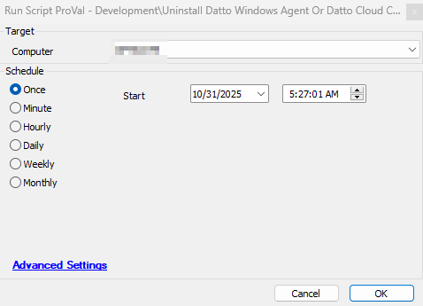

## Summary
This script uninstalls the Datto Windows Agent and Datto Cloud Continuity by grabbing the quietuninstallstring from the registry of the installed application.

## Sample Run

## Dependencies

## Process

- It checks if the agent has Datto Windows Agent or Datto Cloud Continuity installed.
- If detected, then it writes a PS1 on the agent with a MD5 file hash "0E00FB0327D5D58A515946BFFA4FEC07".
- The PS1 fetches the quiet uninstall command from the application registry and executes using system account and uninstalls the application.
- It includes proper error handling

## Output

- Script Log