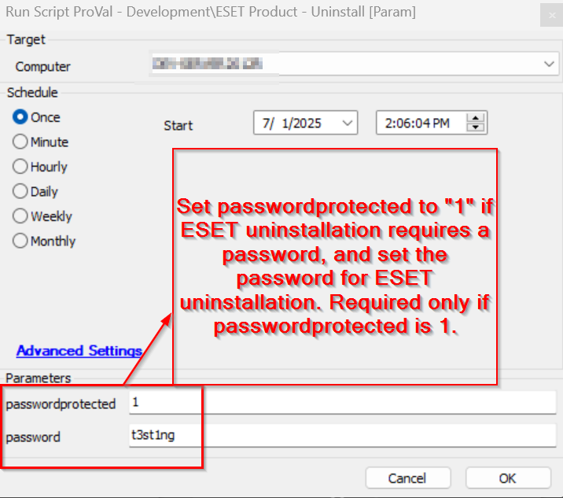
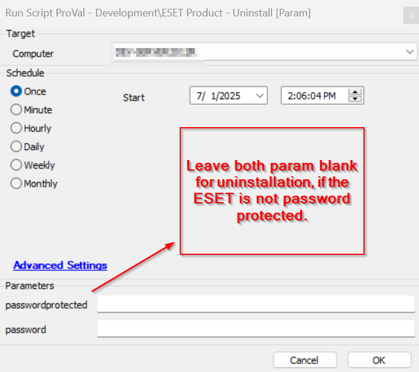

## Summary
Uninstalls ESET products from the system, with optional password protection.

## Sample Run

#### User Parameters

| Name                | Example                                 | Required | Description                                                                                                                                                   |
|---------------------|-----------------------------------------|-----------|---------------------------------------------------------------------------------------------------------------------------------------------------------------|
| passwordprotected                | 0 or 1 | False      | Set to "1" if ESET uninstallation requires a password. Default is "0".                           |
| password    | testing                                       | False     | The password for ESET uninstallation. Required only if passwordprotected is "1". |

## Process

Uninstalls ESET products from the system, with optional password protection.

.EXAMPLE
    
    .\Uninstall-ESET.ps1

    Uninstalls ESET products without password protection.

    .\Uninstall-ESET.ps1 -passwordprotected 1 -password "YourPassword"
    
    Uninstalls ESET products with password protection.

## Output

- Script Logs
- Create log file at working directory