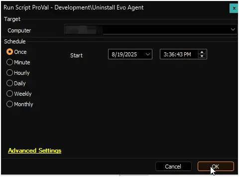

## Summary

This script is a CW Automate adaptation of the PowerShell script [InstallEvoAgent](https://github.com/evosecurity/EvoWindowsAgentDeploymentScripts/blob/master/InstallEvoAgent.ps1). It uninstalls the Evo Agent from Windows machines.

## Sample Run

## Dependencies

- [InstallEvoAgent](https://github.com/evosecurity/EvoWindowsAgentDeploymentScripts/blob/master/InstallEvoAgent.ps1)
- [Evo Agent Deployment](/docs/8a0815ff-2351-4eb6-a199-b0682fb03564)

## Variables

| Name | Value |
| ---- | ----- |
| ProjectName | `InstallEvoAgent` |
| WorkingDirectory | `C:\ProgramData\_automation\script\InstallEvoAgent` |
| ScriptUrl | `https://raw.githubusercontent.com/evosecurity/EvoWindowsAgentDeploymentScripts/refs/heads/master/InstallEvoAgent.ps1` |
| PS1Path | `C:\ProgramData\_automation\script\InstallEvoAgent\InstallEvoAgent.ps1` |
| SoftwareName | `Evo Agent` |

## Output

- Script Logs
