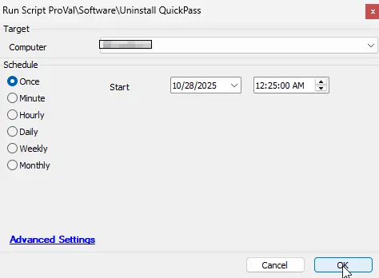

## Summary

This script can be used to silently remove the QuickPass Agent from Windows machines.

## File Hash

- FilePath : `C:\ProgramData\_automation\Script\Uninstall-QuickPass\Uninstall-QuickPass.ps1`  
- File Hash (Sha256): `0B1D4F8C3F1F47D647652AF033438BF29942FCBE5D7F0BF76CB99E485136388C`  
- File Hash (MD5): `E2F96E2FF22D916564645E55AC288864`

## Sample Rum



## Dependencies

- [Solution - QuickPass Deployment](/docs/65d0dbb6-29c1-4242-841c-1da9b92edab6)

## Output

- Script Logs
- Ticketing

## Ticketing

Tickets will be generated only if the `TicketCreationCategory` value is greater than 0. Make sure to use the correct `TicketCreationCategory` to direct the tickets to the right board. You can update the value in the Global Parameters of this script.

**Subject:** `QuickPass Uninstallation Failed for %ClientName%\%ComputerName% at %LocationName%`

**Ticket Body:**

```PlainText
Failed to uninstall QuickPass agent

Command Result: %shellresult%
```
