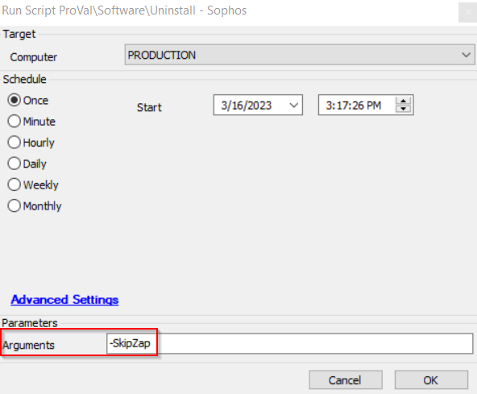

## Summary

This document outlines how to run the Agnostic Remove-Sophos.ps1 script on a target Automate managed device.

**NOTE:** This script will fail if you do not use the SkipZap parameter and Sophos Zap is not installed.  
**NOTE:** TAMPER PROTECTION MUST BE TURNED OFF OR THIS WILL NOT WORK.

## Sample Run

### *It is recommended that you run this script with the NoSafeMode global parameter set to 0; it removes the application cleaner and results in fewer application remnants. Please consider running this in safe mode if possible.*

This setup will skip the removal of the Sophos Zap platform.  

## Dependencies

- [SWM - Software Uninstall - Agnostic - Remove-Sophos](/docs/3e0adee0-1a8c-476a-aea4-616a66b4de12)

## Variables

No non-template variables in the script.

#### Global Parameters

| Name                   | Example        | Required | Description                                                                                             |
|------------------------|----------------|----------|---------------------------------------------------------------------------------------------------------|
| ProjectName            | Remove-Sophos  | True     | The name of the agnostic script minus the .ps1                                                         |
| ExpectedSuccessReturn   | OK             | True     | This is the expected return from the agnostic script; the script will fail if the response is anything other than that. |
| NoSafeMode             | 1              | True     | Setting this to 1 will bypass the safe mode reboot / reboot to normal mode after for a less certain method of removal. |

#### User Parameters

| Name       | Example              | Required | Description                                                                                             |
|------------|----------------------|----------|---------------------------------------------------------------------------------------------------------|
| Arguments  | -SkipZap -Force      | False    | The arguments you would pass if you were to run this script agnostically.                             |

## Output

- Script log

## FAQ

- **The script failed but Sophos was actually removed.**  
  This can happen if you run the script without the -force parameter, then see that the uninstall recommended the force parameter and run the script again on that same machine with the force parameter.

- **There are a lot of leftover files on the target computer.**  
  The cleanest method of removal is to set the Arguments parameter to -force, remembering that you should be using -SkipZap if Zap is not installed with the NoSafeMode set to 0.

