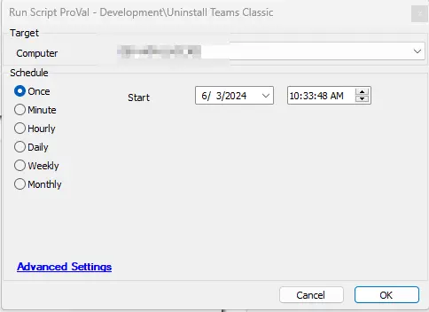

## Summary

This script uninstalls `Microsoft Teams Classic` from Windows machines.

**File Path:** `C:/ProgramData/_Automation/Script/Uninstall-ClassicTeams/Uninstall-ClassicTeams.ps1`  
**File Hash (SHA256):** `3CAF5B7B6E5EC3EB4ADF596CE9729D7C36202298610E2DFA3085C172B4C13ACD`  
**File Hash (MD5):** `C258358FD0B50A6DFAB39AFE289A2380`  

## Sample Run

## Global Parameters

| Name                   | Required | Example | Description                                                                                     |
|------------------------|----------|---------|-------------------------------------------------------------------------------------------------|
| Ticket_On_Failure      | False    | 1       | Set to '1' if you would like to receive a ticket on failure; otherwise, leave it blank or set to '0'. |
| TicketCreationCategory  | False    | 298     | Specify the ticket creation category to direct the tickets to the appropriate board in Manage. |

## Output

- Script Logs
- Ticket (if enabled)

## Ticketing

**Subject:** `Microsoft Teams Classic Uninstallation Failed on %ComputerName% (%ComputerID%)`

**Ticket Body:** `Failed to uninstall Microsoft Teams Classic from machine on %computername% at %clientname%. Here are the results returned from the installer: @psout@`

The PC information is outlined below:  
**PC Name:** %computername%  
**Last Login:** %lastuser%  
**PC Model:** @biosname@  
**OS:** %os%  
**S/N of PC:** @biosver@  
