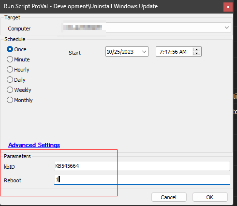
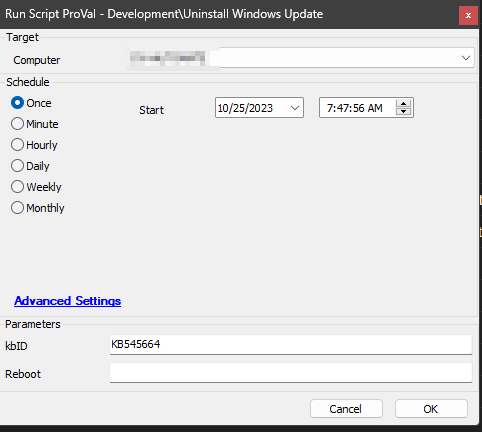

## Summary

The script is designed to facilitate the uninstallation of a specific Windows update on a computer. To achieve this, it requires the user to input the KBID (Knowledge Base Identifier) of the Windows update through a designated user parameter. Additionally, there is an option to authorize a system restart if the update necessitates it, which can be accomplished by providing a '1' in the user parameter for reboot. 

The script will endeavor to remove the targeted update without initiating a system restart when the reboot parameter is either left blank or set to '0'.

**Caution:** It's worth noting, however, that in certain scenarios, the update itself may trigger an involuntary system reboot.

## Sample Run

The computer will undergo a reboot if the patch necessitates a restart to finalize the removal process.

The script will endeavor to prevent an immediate reboot; nonetheless, it is important to acknowledge that, in specific circumstances, the update may autonomously initiate a mandatory system reboot.

#### User Parameters

| Name   | Example   | Required | Description                                                                                     |
|--------|-----------|----------|-------------------------------------------------------------------------------------------------|
| kbID   | KB545664  | True     | KBID (Knowledge Base Identifier) of the Windows update to uninstall.                          |
| Reboot | 1         | False    | To facilitate a system reboot when required, input '1'. Alternatively, enter '0' or leave it blank to prompt an attempt to suppress the reboot. |

## Output

- Script log

