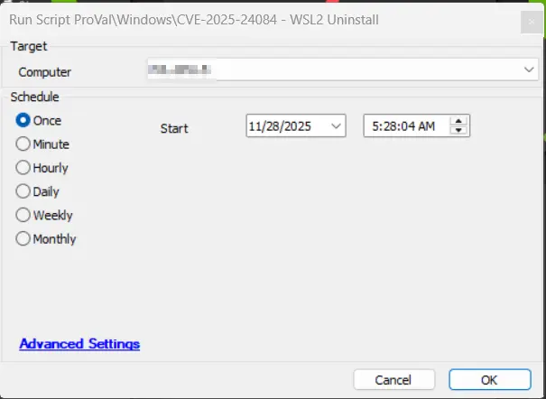

## Summary

This script uninstalls the Windows Subsystem Linux (WSL2) as it has a vulnerability. Refer to the article below for more details:
https://msrc.microsoft.com/update-guide/vulnerability/CVE-2025-24084

## Sample Run

## File Hash

MD5 - `08E46740E31BBC9398E5FACD191FB213`

SHA256 - `69E30DF1E57C30E317D445C2F7459326B2A071E3E6D3A308A2122B153D65B00F`

## Output

- Script log