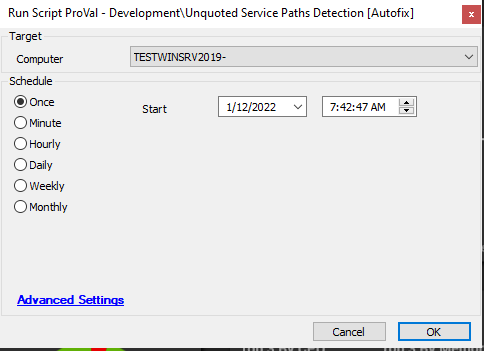
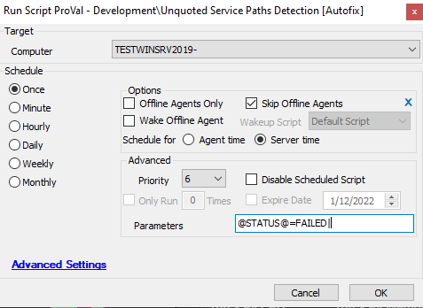

## Summary

The script should be called by the monitor set [ProVal - Development - Unquoted Service Paths Detection](/docs/ab811d99-365c-4ad7-84dd-3ff8575d5b15). It will run a PowerShell script on the machine to fix the services with an unquoted path.

## Sample Run

## Dependencies

[ProVal - Development - Unquoted Service Paths Detection](/docs/ab811d99-365c-4ad7-84dd-3ff8575d5b15)

## Process

The script will fetch the new paths to be set for each unquoted service on the machine and will run a PowerShell script to add quotes to the service paths.

## Output

Script log

