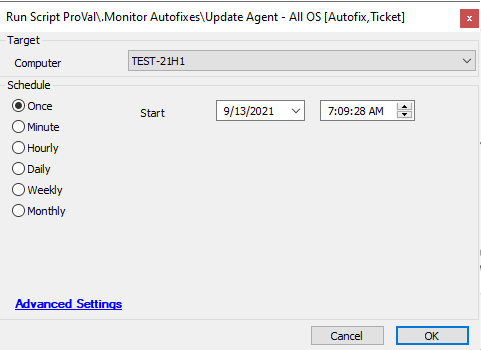

## Summary

The script pulls the highest agent version in the environment and attempts to update any outdated agents.

**Time Saved by Automation:** 2 Minutes

## Sample Run

## Process

- The script runs SQL to pull the highest agent version in the environment and attempts to update the agent using those parameters.
- The script is intended to be used with ProVal – Production – Agent – Out of Date.

