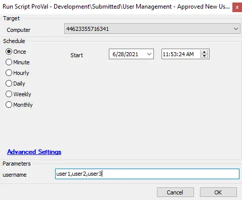

## Summary

This script will enable the users that have been disabled by the dependent script.  
It will also help to update the dependent DataView and custom table.

**Time Saved by Automation:** 15 Minutes

## Sample Run

## Dependencies

- [User Management - New Local Account Audit And Disable [DV, Autofix, Global]](/docs/3b41c8a5-cebe-47bd-a829-9b3fa5701b15)  
- [ProVal - Submitted - New Account Detection](/docs/75f8c13f-04d5-45fd-b650-3b010353a8c0)  
- [New Account Audit and Disable For Approve [Script]](/docs/fac82ae1-8f32-40b3-b9b2-a38f1a71e633)  
- [New User Account Audit Table](/docs/64d9813f-2eba-4448-8d78-c9a001979ee9)  

## Variables

- username

#### User Parameters

| Name     | Example                | Required | Description                                    |
|----------|------------------------|----------|------------------------------------------------|
| username | user1,user2,user3     |          | Provide the usernames that you want to approve.|

## Process

This script is the post-action of the above script; it will run to enable the disabled accounts from the previous script.  
This script is only required when the above script is used to disable accounts. If used only for audit, then this script is not required.

## Output

The location and method by which this script returns data.

Examples:  

- Script log  
- DataView  
- Custom table  
