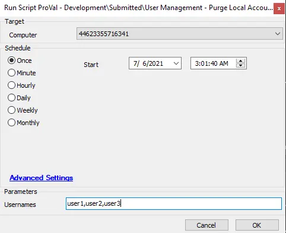

## Summary

This script can be used to completely remove/purge local accounts (including UserSID) manually and automatically from the agent.

**Time Saved by Automation:** 5 Minutes

## Sample Run

## Dependencies

- @custom_proval_computer_accounts (Table)
- @User management - Profile Audit (Script)
- [Local User Detection Not Logged In From 90 Days](/docs/370f7dfe-cf48-40d6-a611-d6a02811393c)

## Variables

| Variable  | Description                                                                                          |
|-----------|------------------------------------------------------------------------------------------------------|
| psout     | This contains PowerShell script output indicating whether the complete profile was removed or not. |
| fieldname | This contains a list of user accounts inactive for 90 days                                           |
| status    | It detects the dependent monitor status for the agent                                               |

#### Global Parameters

| Name      | Example                               | Required | Description                                         |
|-----------|---------------------------------------|----------|-----------------------------------------------------|
| LogPath   | C:/temp/Remove-LocalUserProfile.log  | True     | This path stores the logging of the completed script.   |
| AutoPurge | False                                 | True     | False -- Auto Purge is off, Usernames required; True -- Auto Purge is ON, Usernames not required |

#### User Parameters

| Name      | Example              | Required    | Description                                                                                      |
|-----------|----------------------|-------------|--------------------------------------------------------------------------------------------------|
| Usernames | user1,user2,user3   | True/False  | Provide a list of users to remove when AutoPurge = False; leave blank for AutoPurge = True.   |

## Process

- This script can be used to perform both manual removal of users and automatic purge.
- For automatic purge, set AutoPurge = True; the usernames not logged in for more than 90 days will be picked from the dependent monitor, and this script will trigger as an autofix to remove them.
- For manual purge, provide the usernames to remove from the agent.

## Output

- Script log