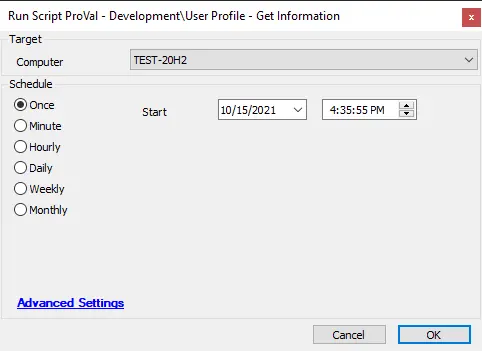

## Summary

This script gathers information about user profiles. The data is stored in the custom table [plugin_proval_userprofiles](/docs/7a87abf3-b410-491b-bbc1-534092e61f55).

**Note:** This script is not supported on Windows Domain Controllers or deprecated versions of Windows. An error will be thrown if it is run against one.

## File Hash

- **File Path:** `C:/ProgramData/_Automation/script/Get-UserProfiles/Get-UserProfilesAI.ps1`  
  **File Hash (SHA256):** `782A08CB0AB705D3992280FA6A86EF2AC1A5B6DEEF7E979FC90F76EB32EF6787`  
  **File Hash (MD5):** `32621978F70465D5C41BCAE331D01668`  

- **File Path:** `C:/ProgramData/_Automation/script/Get-UserProfiles/Get-UserProfiles.ps1`  
  **File Hash (SHA256):** `FDE0F31BB08DC85F8260D437284927F0D6907C88C04F8728ED9D67C125886663`  
  **File Hash (MD5):** `1DF4E90E6E42BA0540944AF8C85A181B`  

## Sample Run

## Dependencies

- [EPM - Accounts - Agnostic - Get-UserProfiles](/docs/dee76265-9071-47bb-9262-d656dd8b5c6d)
- PowerShell v5

## Output

- Script log
- Local file on computer
- Dataview