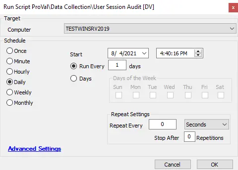

## Summary

This script will create the SQL table “@plugin_proval_usersessions” if it does not exist, then run PowerShell to audit the current active sessions on a target machine and update the details in the custom table.

**Time Saved by Automation:** 5 Minutes

## Sample Run

## Dependencies

- @plugin_proval_usersessions (Table)
- [Windows - Current User Sessions](/docs/ea5d1545-a2d7-4c9e-a61e-b89e43da2b9c)

## Variables

- `@psout@` -> Logs the output of PowerShell

## Process

1. This script creates the custom table @plugin_proval_usersessions if it doesn't already exist.
2. Runs a PowerShell script to audit the user session.
3. Logs the output of PowerShell to Automate's script logs.

## Output

- Script log
