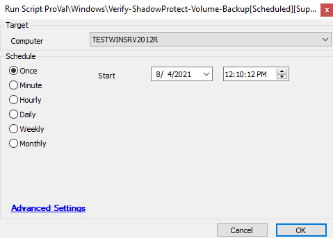

## Summary

This script queries the LT database for each drive letter that is an NTFS volume on a computer.

**Time Saved by Automation:** 5 Minutes

## Sample Run

## Dependencies

- `@Verify-ShadowProtect-Volume-Backup-byLetter[SubScript]` (script)

## Variables

- `%sqldataset%` -> grabs ComputerID, Letter, Size, FileSystem, SmartStatus, and Model
- `@DriveLetterString@` -> this is set empty for use later in the subscript.

## Process

1. Sets up two variables: `DriveLetterString` and `rowcountA`.
2. Starts querying the database and retrieving the drive information.
3. Sends that information to the subscript for ShadowProtect verification.
4. Loops until this is completed for all machines the script is run on.

## Output

- Script log

