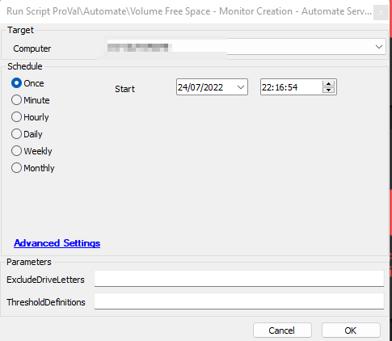

## Summary

This script runs similarly to the [CWM - Automate - Script - Volume Free Space - Monitor Creation](/docs/dee853b7-69a6-4f0d-ad2f-7238a10851f4) script with a few changes. It is intended to use the dynamic monitor generated by the [CWM - Automate - Script - Volume Free Space - Monitor Creation](/docs/dee853b7-69a6-4f0d-ad2f-7238a10851f4) script to monitor the Automate server's drives and to generate a ticket in our (ProVal's) Autotask portal for any failures.

## Sample Run

User parameters are only left in place in case we ever require them for any servers.

It is preferred to schedule the script against the "Labtech Server" group to run once per day.

## Dependencies

- [EPM - Disk - Agnostic - Get-VolumeExhaustionEstimate](/docs/21bc13d3-b2fb-42d5-8f38-da9b43990e06)
- [EPM - Disk - Agnostic - Get-VolumeThresholds](/docs/e36d9583-23da-4dfa-96c8-3467e36e30cf)
- PowerShell v5

## Process

Referred to: [CWM - Automate - Script - Volume Free Space - Monitor Creation](/docs/dee853b7-69a6-4f0d-ad2f-7238a10851f4)

## Output

- Script log
- Remote Monitor

