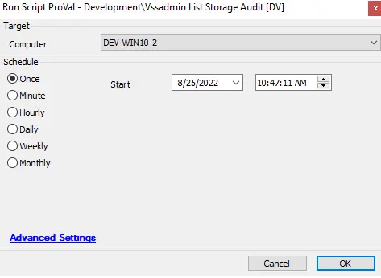

## Summary

This script will help audit the VSSAdmin storage details. It will report for all volumes where VSS storage is enabled; if it is not enabled for any volume, it will report "No Drive."

## Sample Run

## Dependencies

- [VSS Resize](/docs/0600e89c-06a5-42da-9ed8-41e43d9cfd7d)  
- [plugin_proval_vssadminstorage](/docs/165f6290-8932-459b-9bfe-18c86f7a61d6)  
- [VSSAdmin Storage Audit](/docs/7f7e7d3b-047d-41dc-acc2-5083adcaaf39)  

## Variables

| Name   | Description                               |
|--------|-------------------------------------------|
| output | Contains the output of the VSSAdmin size audit |

## Process

This script runs PowerShell to check whether the VSSAdmin storage is placed on the drive. If it is placed, the script detects the volume letter, total size, allocated size for storage, maximum storage size, and script run time, storing these details in a table for auditing.

## Output

The location and method by which this script returns data:

- Script log
- plugin_proval_vssadminstorage
- Dataview