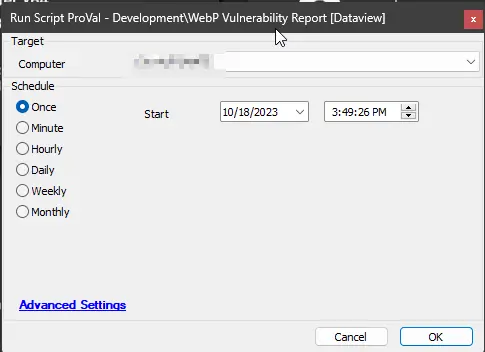

## Summary

The script conducts a comparison between the names of currently installed applications and the designated `app_name` entries within the vulnerable Electron application, as specified in the provided [JSON](https://raw.githubusercontent.com/mttaggart/electron-app-tracker/main/electron_apps.json) file. Subsequently, it retrieves and presents both the application name and version that are currently installed on the system, along with pertinent vulnerability status information outlined in the aforementioned [JSON](https://raw.githubusercontent.com/mttaggart/electron-app-tracker/main/electron_apps.json) file.

Following this data retrieval process, the script proceeds to present this information within a designated dataview titled [WebP Vulnerability Report](/docs/676b6cff-c336-4038-8429-f3bd64e45b5e).

**WARNING:** It's important to note that the information obtained through this automated process may not achieve absolute accuracy, given its reliance on comparing application names with those listed in the provided [JSON](https://raw.githubusercontent.com/mttaggart/electron-app-tracker/main/electron_apps.json) file. Therefore, it is advisable to exercise human judgment when interpreting the data presented in the [WebP Vulnerability Report](/docs/676b6cff-c336-4038-8429-f3bd64e45b5e) dataview, in order to accurately discern the applications that are genuinely vulnerable.

**NOTE:** The functionality of this script relies on PowerShell for its execution. It is important to note that the successful retrieval of data from the computer systems is contingent upon the PowerShell version being 5.0 or newer. In cases where the PowerShell version is older than 5.0, the script may not guarantee the fetching of data from the targeted systems.

## Sample Run

## Dependencies

[**EPM - Security - Internal Monitor - Execute Script - WebP Vulnerability Report**](/docs/5d5a553e-6a1b-41d0-a801-59a61ff8d5bc)

## Output

- Script log
- Dataview

