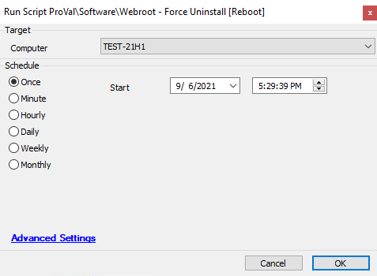

## Summary

This script will boot the machine in safe mode and attempt to completely wipe Webroot from the target machine.

**Time Saved by Automation:** 20 Minutes

## Sample Run

## Process

This script first checks if the Webroot service is running on the machine. If it is, the script will boot the machine in safe mode and attempt to completely wipe Webroot from the target machine. It further verifies whether the uninstallation was successful.

## Output

- Script log

