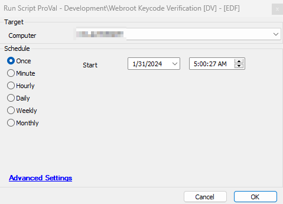

## Summary

This script collects the machine's Webroot hashed keycode and matches it with the keycode set up in the client EDF "Webroot Site Keycode". The results can be reviewed using the dataview, or tickets can be automatically generated for mismatched license keys with the [Internal Monitor - Wrong Webroot KeyCode Detected [EDF]](/docs/70bf86a4-3ddf-46b1-947d-e2dc580209a5) where the ticket category is set.

## Sample Run

## Dependencies

[SEC - Endpoint Protection - Monitor - Wrong Webroot KeyCode Detected [EDF]](/docs/70bf86a4-3ddf-46b1-947d-e2dc580209a5)

## EDFs

| Name                                   | Level    | Required | Description                                                                                                      |
|----------------------------------------|----------|----------|------------------------------------------------------------------------------------------------------------------|
| Webroot Encrypted KeyCode              | Computer | True     | Stores keycode grabbed from the computer                                                                          |
| Webroot KeyCode Status                 | Computer | True     | Stores the keycode's status as either `KeyCode Matched` or `KeyCode Not Matched`                               |
| Webroot Site KeyCode                   | Client   | True     | Stores the site keycode which is available at the portal. Follow the document below on how to get the keycode: [Webroot Site KeyCode](/docs/bde90a61-771c-46ef-98f5-3278febb3278) |

## Output

- Script log
- EDF
- Dataview

