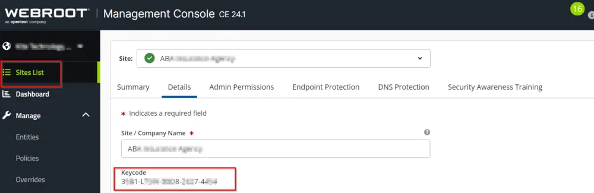

## Step 1
Login to the Webroot Portal.

## Step 2
Go to the Site List --> Sites --> Details.

You will set the code in the format `xxxx-xxxx-xxxx-xxxx-xxxx`.

## Step 3
Copy the code and paste it into the client EDF 'Webroot Site KeyCode' for the solution to work.