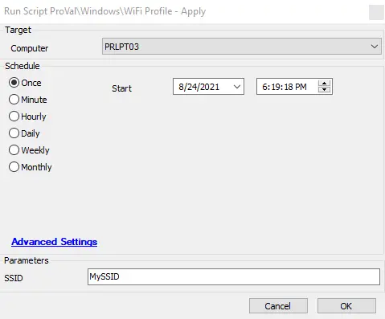

## Summary

The script applies the WiFi configuration for the desired SSID.

**Time Saved by Automation:** 10 Minutes

## Sample Run

## Dependencies

- [WiFi Profile - Get](/docs/95ecf8ed-f2ac-46fa-ad7a-05894d0743be)
- @plugin_proval_wifi_profiles (Table)

## Variables

### User Parameters

| Name  | Example | Required | Description                                                                 |
|-------|---------|----------|-----------------------------------------------------------------------------|
| SSID  | MySSID  | True     | This should be the SSID (Service Set Identifier) of the desired WiFi profile.|

## Process

- The script should be used after the WiFi profile has been gathered by running the [WiFi Profile - Get](/docs/95ecf8ed-f2ac-46fa-ad7a-05894d0743be) script against a machine with the profile already set up.
- It retrieves the XML profile from the database based on the ClientID and SSID provided, writes the output to a file, and imports the profile onto the target machine.

## Output

- Script log
