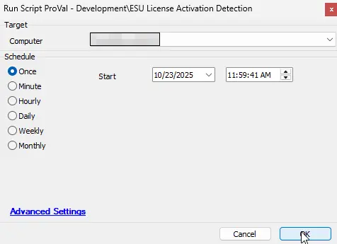

## Summary

This script performs checks for ESU license activation detection and stores the information to the computer EDF `ESU Detection`, reflecting it in the DV.

## Sample Run

## Dependencies

[Solution - Windows 10 ESU Licensing and Auditing](/docs/7fe6a52b-79fd-487b-8009-523996e74d11)

## Output

- Script log
- EDF
- Dataview