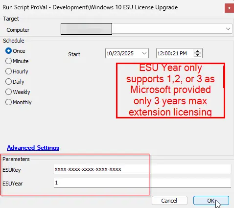

## Summary
The Windows 10 Extended Security Updates program provides critical security patches for up to three years beyond the official end of support date. It’s intended for systems that cannot be upgraded immediately due to hardware, software compatibility, or organizational constraints.
Referred to the articles:
https://learn.microsoft.com/en-us/windows/whats-new/enable-extended-security-updates
https://www.systemcenterdudes.com/deploy-windows-10-extended-security-update-key-with-intune-or-sccm/

This writes a ps1 script at path "C:\ProgramData\_automation\script\Windows10ESU\Windows10ESU.ps1" and executes it with the mandatory parameters for ESU license key and ESU year (1, 2, or 3).

Note: If there is any third party application that blocks the ps1 execution then please whitelist the below hash:

MD5 Hash - 482D97168698073FA7D66F66E8546DD7
SHA256 Hash - C41A3FB22C5193A665BAC448EB15152E3B289313B521C5E43EB4C8B74E053D83

## Sample Run

## Dependencies

[Solution - Windows 10 ESU Licensing and Auditing](/docs/7fe6a52b-79fd-487b-8009-523996e74d11)

## User Parameters

| Name        | Example                                                            | Required | Description                                                                                       |
|-------------|--------------------------------------------------------------------|----------|---------------------------------------------------------------------------------------------------|
| ESUKey         | xxxx-xxxx-xxxx-xxxx-xxxx | True    | Provide the ESU license key for the Windows 10 extended support     |
| ESUYear   | 1                                                                  | True    | Set this to the number of years for which the ESU license being issued. The max number is 3 as Microsoft has only allowed for maximum three years extension |

## Output

- Script log